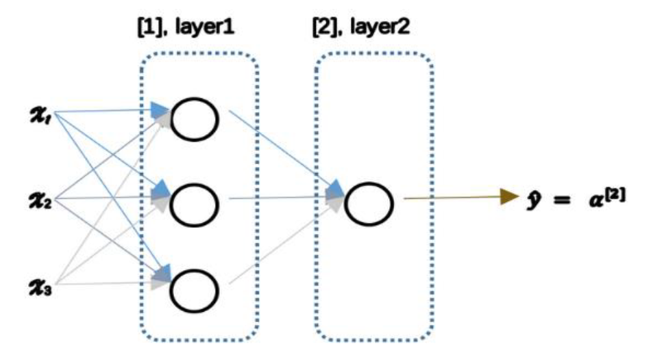
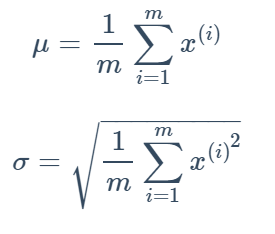
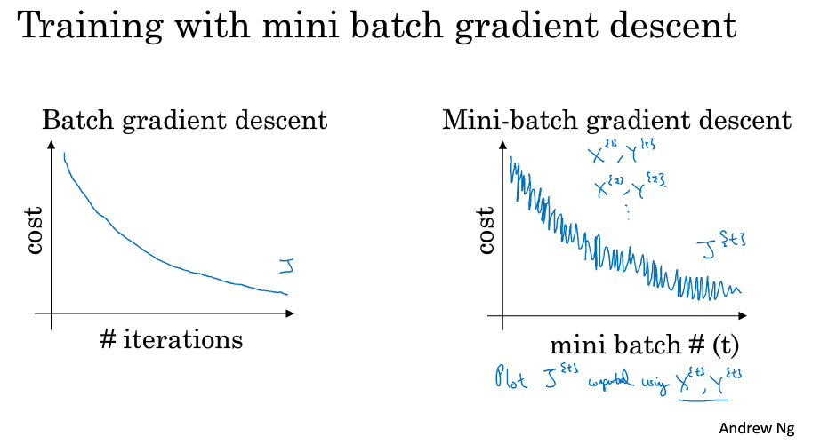
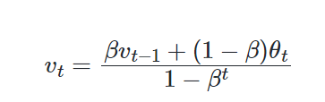

[TOC]

# PART1.神经网络和深度学习

## 一、综述

### 课程规划

1.学习如何建立神经网络，包含一个深度神经网络，以及如何在数据上面训练。结尾用一个深度神经网络进行辨认猫（猫咪识别）

2.进行深度学习方面的实践，如何真正让它表现良好。包括超参数调整，正则化，诊断偏差和方差以及一些高级优化算法

3.学习如何结构化机器学习工程

4.cnn：卷积神经网络(**CNN(s)**)，它经常被用于图像领域，你将会在第四门课程中学到如何搭建这样的模型。

5.nlp：序列模型：包括的模型有循环神经网络（**RNN**）、全称是长短期记忆网络（**LSTM**）。你将在课程五中了解其中的时期是什么含义，并且有能力应用到自然语言处理（**NLP**）问题。


### 什么是神经网络

由一个房价预测模型，构建的神经网络

神经网络的一部分神奇之处在于，当你实现它之后，你要做的只是输入x，就能得到输出y。因为它可以自己计算你训练集中样本的数目以及所有的中间过程。所以，你实际上要做的就是：这里有四个输入的神经网络，这输入的特征可能是房屋的大小、卧室的数量、邮政编码和区域的富裕程度。给出这些输入的特征之后，神经网络的工作就是预测对应的价格。同时也注意到这些被叫做隐藏单元圆圈，在一个神经网络中，它们每个都从输入的四个特征获得自身输入，比如说，第一个结点代表家庭人口，而家庭人口x1仅仅取决于和x2特征，换句话说，在神经网络中，你决定在这个结点中想要得到什么，然后用所有的四个输入来计算想要得到的。因此，我们说输入层和中间层被紧密的连接起来了。

值得注意的是神经网络给予了足够多的关于x和y的数据，给予了足够的训练样本有关x和y。神经网络非常擅长计算从x到y的精准映射函数。

这就是一个基础的神经网络。你可能发现你自己的神经网络在监督学习的环境下是如此的有效和强大，也就是说你只要尝试输入一个x，即可把它映射成y，就好像我们在刚才房价预测的例子中看到的效果。

### 神经网络的监督学习

机器学习对于结构化数据和非结构化数据的应用，结构化数据意味着数据的基本数据库。例如在房价预测中，你可能有一个数据库，有专门的几列数据告诉你卧室的大小和数量，这就是结构化数据。或预测用户是否会点击广告，你可能会得到关于用户的信息，比如年龄以及关于广告的一些信息，然后对你的预测分类标注，这就是结构化数据，意思是每个特征，比如说房屋大小卧室数量，或者是一个用户的年龄，都有一个很好的定义。

相反非结构化数据是指比如音频，原始音频或者你想要识别的图像或文本中的内容。这里的特征可能是图像中的像素值或文本中的单个单词。

### 什么深度学习会兴起

大数据时代

硬件发展

算法更新


### 关于这门课

下面是关于第一门课的一些细节，这门课有四周的学习资料：

第一周：关于深度学习的介绍。

第二周：关于神经网络的编程知识，了解神经网络的结构，逐步完善算法并思考如何使得神经网络高效地实现。

第三周：在学习了神经网络编程的框架之后，你将可以编写一个隐藏层神经网络，所以需要学习所有必须的关键概念来实现神经网络的工作.

第四周：建立一个深层的神经网络。


## 二、神经网络基础

### logistic回归

在机器学习实战的logistic回归部分笔记重复，补充：


1.loss（error）function：损失函数，单个样本的误差；

   cost function：成本（代价）函数，全体训练样本的误差J（θ）=loss function 累加/m（样本数）


2.在矩阵乘除法时，对你不确定的变量使用reshape(m,n)去重塑他的形状以确保代码不会出现问题


3.在使用numpy的时候，不要使用秩为1的数组，.shape()输出的是(n,),请初始化矩阵来确保不会出现bug

```
a =  np.random.randn(5)
# a.shape() = (5,)

a =  np.random.randn(5,1)
a =  np.random.randn(1,5)
# a.shape() = (5,1)或者(1,5)
```


4.当不确定某些值时，使用断言

```
assert（bool表达式）
```


## 三、浅层神经网络

### 神经网络概述

对于逻辑回归模型如下


公式


如上所示，首先你需要输入特征𝑥，参数 𝑤和 𝑏，通过这 些你就可以计算出 𝑧，


接下来使用𝑧就可以计算出 𝑎。我们将的符号换为表示输出𝑦^ ⟹𝑎=𝜎(𝑧),然后可以计算出 loss function 𝐿(𝑎,𝑦)

可以把许多sigmoid单元堆叠起来形成一个神经网络。




### 神经网络表示

竖向堆叠起来的输入特征被称作神经网络的**输入层（the input layer）**。

神经网络的**隐藏层（a hidden layer）**。“隐藏”的含义是**在训练集中**，这些中间节点的真正数值是无法看到的。

**输出层（the output layer）**负责输出预测值。


如图是一个**双层神经网络**，也称作**单隐层神经网络**。当我们计算网络的层数时，通常不考虑输入层，因此图中隐藏层是第一层，输出层是第二层。

约定俗成的符号表示是：

- 输入层的激活值为 a[0]a[0]；
- 同样，隐藏层也会产生一些激活值，记作 a[1]a[1] 隐藏层的第一个单元（或者说节点）就记作 a1[1]输出层同理。
- 另外，隐藏层和输出层都是带有参数 W 和 b 的。它们都使用上标`[1]`来表示是和第一个隐藏层有关，或者上标`[2]`来表示是和输出层有关。

### 计算神经网络的输出


实际上，神经网络只不过将 Logistic 回归的计算步骤重复很多次。对于隐藏层的第一个节点，有 

$$
z _1^{[1]} = (W _1^{[1]})^TX+b _1^{[1]}
$$

$$
a _1^{[1]} = \sigma(z _1^{[1]})
$$

我们可以类推得到，对于第一个隐藏层有下列公式：

$$
z^{[1]} = (W^{[1]})^Ta^{[0]}+b^{[1]}
$$

$$
a^{[1]} = \sigma(z^{[1]})
$$

其中，a[0]可以是一个列向量，也可以将多个列向量堆叠起来得到矩阵。如果是后者的话，得到的 z[1]和 a[1]也是一个矩阵。

同理，对于输出层有：

$$
z^{[2]} = (W^{[2]})^Ta^{[1]}+b^{[2]}
$$

$$
\hat{y} = a^{[2]} = \sigma(z^{[2]})
$$


值得注意的是层与层之间参数矩阵的规格大小。

* 输入层和隐藏层之间： (W[1])T 的 shape 为`(4,3)`，前面的 4 是隐藏层神经元的个数，后面的 3 是输入层神经元的个数；b[1]的 shape 为`(4,1)`，和隐藏层的神经元个数相同。
* 隐藏层和输出层之间：(W[2])T的 shape 为`(1,4)`，前面的 1 是输出层神经元的个数，后面的 4 是隐藏层神经元的个数；b[2]的 shape 为`(1,1)`，和输出层的神经元个数相同。


### 多样本向量化计算

我们把样本组合成矩阵,避免了m次的for循环


### 向量化实现的解释


### 激活函数

有一个问题是神经网络的隐藏层和输出单元用什么激活函数。之前我们都是选用 sigmoid 函数，但有时其他函数的效果会好得多。

可供选用的激活函数有：

- tanh 函数（双曲正切函数）：

  

效果几乎总比 sigmoid 函数好（除开**二元分类的输出层**，因为我们希望输出的结果介于 0 到 1 之间），因为函数输出介于 -1 和 1 之间，激活函数的平均值就更接近 0，有类似数据中心化的效果。

然而，tanh 函数存在和 sigmoid 函数一样的缺点：当 z 趋紧无穷大（或无穷小），导数的梯度（即函数的斜率）就趋紧于 0，这使得梯度算法的速度大大减缓。

- ReLU 函数（修正线性单元）

  

当 z > 0 时，梯度始终为 1，从而提高神经网络基于梯度算法的运算速度，收敛速度远大于 sigmoid 和 tanh。然而当 z < 0 时，会导致神经元死亡，当一个神经元在某次的激活值为 0 之后，此后得到的激活值都是 0.但是实际的运用中，该缺陷的影响不是很大。

- Leaky ReLU（带泄漏的 ReLU）：

  

Leaky ReLU 保证在 z < 0 的时候，梯度仍然不为 0。理论上来说，Leaky ReLU 有 ReLU 的所有优点，但在实际操作中没有证明总是好于 ReLU，因此不常用。


在选择激活函数的时候，如果在不知道该选什么的时候就选择 ReLU，当然也没有固定答案，要依据实际问题在交叉验证集合中进行验证分析。当然，我们可以在不同层选用不同的激活函数。


### 为什么需要非线性激活函数？


使用线性激活函数和不使用激活函数、直接使用 Logistic 回归没有区别，那么无论神经网络有多少层，输出都是输入的线性组合，与**没有隐藏层**效果相当，就成了最原始的感知器了。


### 激活函数的导数

sigmoid 函数


tanh 函数：


ReLU函数：


在实践中如果不知道如何选激活函数，**一般默认选 ReLU**。因为相比于 Sigmoid 和 Tanh 等激活函数，ReLU 有两个突出的**优势**：

一是**缓解了梯度消失**的问题（x 大于0的右侧），只要 x 大于 0，导数就为1；

二是**计算效率高**，模型学起来快得多。一个原因是避免了大量的**指数运算**。另一个原因是函数导数有**约一半的概率为 0** ，减少了很多**非零计算**。并且在训练效果上，由于模型很大，即便很多隐藏单元的导数为 0，网络中**也有足够多的单位**使 x 大于0。因此，对于大多数训练例子来说，学习仍然是快且有效的。


Leaky ReLu 激活函数：


### 神经网络的梯度下降

### 正向传播


### 反向梯度下降

神经网络反向梯度下降公式（左）和其代码向量化（右）：


### 随机初始化

如果在初始时将两个隐藏神经元的参数设置为相同的大小，那么两个隐藏神经元对输出单元的影响也是相同的，通过反向梯度下降去进行计算的时候，会得到同样的梯度大小，所以在经过多次迭代后，两个隐藏层单位仍然是对称的。无论设置多少个隐藏单元，其最终的影响都是相同的，那么多个隐藏神经元就没有了意义。

在初始化的时候，W 参数要进行随机初始化，不可以设置为 0。而 b 因为不存在对称性的问题，可以设置为 0。

以 2 个输入，2 个隐藏神经元为例：

```python
W = np.random.rand(2,2)* 0.01
b = np.zeros((2,1))
```

这里将 W 的值乘以 0.01（或者其他的常数值）的原因是为了使得权重 W 初始化为较小的值，这是因为使用 sigmoid 函数或者 tanh 函数作为激活函数时，W 比较小，则 Z=WX+b 所得的值趋近于 0，梯度较大，能够提高算法的更新速度。而如果 W 设置的太大的话，得到的梯度较小，训练过程因此会变得很慢。

ReLU 和 Leaky ReLU 作为激活函数时不存在这种问题，因为在大于 0 的时候，梯度均为 1。


补充：

神经网络原理：https://www.youtube.com/c/3blue1brown/search?query=%E7%A5%9E%E7%BB%8F%E7%BD%91%E7%BB%9C

从线性，逻辑回归推导到神经网络反向梯度下降：https://blog.csdn.net/zhaohongfei_358/article/details/120987506

## 四、深层神经网络深层网络中的前向和反向传播

### 前向传播

**输入**：$a^{[l−1]}$

**输出**：$a^{[l]}$，cache($z^{[l]}$)

**公式**：

$$Z^{[l]}=W^{[l]}\cdot a^{[l-1]}+b^{[l]}$$

$$a^{[l]}=g^{[l]}(Z^{[l]})$$

### 反向传播

**输入**：$da^{[l]}$

**输出**：$da^{[l-1]}$，$dW^{[l]}$，$db^{[l]}$

**公式**：

$$dZ^{[l]}=da^{[l]}*g^{[l]}{'}(Z^{[l]})$$

$$dW^{[l]}=dZ^{[l]}\cdot a^{[l-1]}$$

$$db^{[l]}=dZ^{[l]}$$

$$da^{[l-1]}=W^{[l]T}\cdot dZ^{[l]}$$

### 搭建深层神经网络块


神经网络的一步训练（一个梯度下降循环），包含了从 $a^{[0]}$（即 x）经过一系列正向传播计算得到 $\hat y$ （即 $a^{[l]}$）。然后再计算 $da^{[l]}$，开始实现反向传播，用**链式法则**得到所有的导数项，W 和 b 也会在每一层被更新。

在代码实现时，可以将正向传播过程中计算出来的 z 值缓存下来，待到反向传播计算时使用。


## 矩阵的维度

$$W^{[l]}: (n^{[l]}, n^{[l-1]})$$

$$b^{[l]}: (n^{[l]}, 1)$$

$$dW^{[l]}: (n^{[l]}, n^{[l-1]})$$

$$db^{[l]}: (n^{[l]}, 1)$$

对于 Z、a，向量化之前有：

$$Z^{[l]}, a^{[l]}: (n^{[l]}, 1)$$

而在向量化之后，则有：

$$Z^{[l]}, A^{[l]}: (n^{[l]}, m)$$

在计算反向传播时，$dZ$、$dA$ 的维度和 $Z$、$A$ 是一样的。


## 使用深层表示的原因

对于人脸识别，神经网络的第一层从原始图片中提取人脸的轮廓和边缘，每个神经元学习到不同边缘的信息；网络的第二层将第一层学得的边缘信息组合起来，形成人脸的一些局部的特征，例如眼睛、嘴巴等；后面的几层逐步将上一层的特征组合起来，形成人脸的模样。随着神经网络层数的增加，特征也从原来的边缘逐步扩展为人脸的整体，由整体到局部，由简单到复杂。层数越多，那么模型学习的效果也就越精确。

同样的，对于语音识别，第一层神经网络可以学习到语言发音的一些音调，后面更深层次的网络可以检测到基本的音素，再到单词信息，逐渐加深可以学到短语、句子。

通过例子可以看到，随着神经网络的深度加深，模型能学习到更加复杂的问题，功能也更加强大。


## 参数和超参数

**参数**即是我们在过程中想要模型学习到的信息（**模型自己能计算出来的**），例如 $W^{[l]}$，$b^{[l]}$。而**超参数（hyper parameters）**即为控制参数的输出值的一些网络信息（**需要人经验判断**）。超参数的改变会导致最终得到的参数 $W^{[l]}$，$b^{[l]}$ 的改变。

典型的超参数有：

* 学习速率：α
* 迭代次数：N
* 隐藏层的层数：L
* 每一层的神经元个数：$n^{[1]}$，$n^{[2]}$，...
* 激活函数 g(z) 的选择

当开发新应用时，预先很难准确知道超参数的最优值应该是什么。因此，通常需要尝试很多不同的值。应用深度学习领域是一个很大程度基于经验的过程。


# PART2.改善深层神经网络：超参数调试、正则化以及优化

## 一、  深度学习的实用层面

### 数据划分：训练 / 验证 / 测试集

应用深度学习是一个典型的迭代过程。

对于一个需要解决的问题的样本数据，在建立模型的过程中，数据会被划分为以下几个部分：

* 训练集：用训练集对算法或模型进行**训练**过程；
* 验证集：利用验证集（又称为简单交叉验证集）进行**交叉验证**，**选择出最好的模型**；
* 测试集：最后利用测试集对模型进行测试，**获取模型运行的无偏估计**（对学习方法进行评估）。


在**小数据量**的时代，如 100、1000、10000 的数据量大小，可以将数据集按照以下比例进行划分：

* 无验证集的情况：70% / 30%；
* 有验证集的情况：60% / 20% / 20%；


而在如今的**大数据时代**，对于一个问题，我们拥有的数据集的规模可能是百万级别的，所以验证集和测试集所占的比重会趋向于变得更小。

验证集的目的是为了验证不同的算法哪种更加有效，所以验证集只要足够大到能够验证大约 2-10 种算法哪种更好，而不需要使用 20% 的数据作为验证集。如百万数据中抽取 1 万的数据作为验证集就可以了。

测试集的主要目的是评估模型的效果，如在单个分类器中，往往在百万级别的数据中，我们选择其中 1000 条数据足以评估单个模型的效果。

* 100 万数据量：98% / 1% / 1%；
* 超百万数据量：99.5% / 0.25% / 0.25%（或者99.5% / 0.4% / 0.1%）


**建议**

建议**验证集要和训练集来自于同一个分布**（数据来源一致），可以使得机器学习算法变得更快并获得更好的效果。


**补充：交叉验证（cross validation）**

交叉验证的基本思想是重复地使用数据；把给定的数据进行切分，将切分的数据集组合为训练集与测试集，在此基础上反复地进行训练、测试以及模型选择。


### 模型估计：偏差 / 方差

**“偏差-方差分解”**是解释学习算法泛化性能的一种重要工具。

泛化误差可分解为偏差、方差与噪声之和：

* **偏差**：度量了学习算法的期望预测与真实结果的偏离程度，即刻画了**学习算法本身的拟合能力**；
* **方差**：度量了同样大小的训练集的变动所导致的学习性能的变化，即刻画了**数据扰动所造成的影响**；
* **噪声**：表达了在当前任务上任何学习算法所能够达到的期望泛化误差的下界，即刻画了**学习问题本身的难度**。

偏差-方差分解说明，**泛化性能**是由**学习算法的能力**、**数据的充分性**以及**学习任务本身的难度**所共同决定的。给定学习任务，为了取得好的泛化性能，则需要使偏差较小，即能够充分拟合数据，并且使方差较小，即使得数据扰动产生的影响小。

​																																												<!-- 周志华《机器学习》 -->


在**欠拟合**的情况下，出现**高偏差**的情况，即不能很好地对数据进行分类。

当模型设置的太复杂时，训练集中的一些噪声没有被排除，使得模型出现**过拟合**的情况，在验证集上出现**高方差**的现象。

当训练出一个模型以后，如果：

* 训练集的错误率较小，而验证集的错误率却较大，说明模型存在较大方差，可能出现了过拟合；
* 训练集和开发集的错误率都较大，且两者相当，说明模型存在较大偏差，可能出现了欠拟合；
* 训练集错误率较大，且开发集的错误率远较训练集大，说明方差和偏差都较大，模型很差；
* 训练集和开发集的错误率都较小，且两者的相差也较小，说明方差和偏差都较小，这个模型效果比较好。

偏差和方差的权衡问题对于模型来说十分重要。

最优误差（基本误差）通常也称为“贝叶斯误差”。


### **应对方法**

训练模型的过程

存在高偏差：

* 扩大网络规模，如添加隐藏层或隐藏单元数目；
* 寻找合适的网络架构，使用更大的 NN 结构；
* 花费更长时间训练。

存在高方差：

* 获取更多的数据；
* 正则化；
* 寻找更合适的网络结构。

不断尝试，直到找到低偏差、低方差的框架。

在深度学习的早期阶段，没有太多方法能做到只减少偏差或方差而不影响到另外一方。而在大数据时代，深度学习对监督式学习大有裨益，使得我们不用像以前一样太过关注如何平衡偏差和方差的权衡问题，通过以上方法可以在不增加某一方的前提下减少另一方的值。


### 正则化

**正则化**是在成本函数中加入一个正则化项，惩罚模型的复杂度。正则化可以用于解决高方差的问题。

#### Logistic 回归中的正则化

对于 Logistic 回归，加入 L2 正则化（也称“L2 范数”）的成本函数：

$$J(w,b) = \frac{1}{m}\sum_{i=1}^mL(\hat{y}^{(i)},y^{(i)})+\frac{\lambda}{2m}{||w||}^2\_2$$

* L2 正则化：$$\frac{\lambda}{2m}{||w||}^2\_2 = \frac{\lambda}{2m}\sum_{j=1}^{n\_x}w^2\_j = \frac{\lambda}{2m}w^Tw$$
* L1 正则化：$$\frac{\lambda}{2m}{||w||}\_1 = \frac{\lambda}{2m}\sum_{j=1}^{n\_x}{|w\_j|}$$

其中，λ 为**正则化因子**，是**超参数**。

由于 L1 正则化最后得到 w 向量中将存在大量的 0，使模型变得稀疏化，因此 L2 正则化更加常用。

**注意**，`lambda`在 Python 中属于保留字，所以在编程的时候，用`lambd`代替这里的正则化因子。

#### 神经网络中的正则化

对于神经网络，加入正则化的成本函数：


因为 w 的大小为 ($n^{[l−1]}$, $n^{[l]}$)，因此


该矩阵范数被称为**弗罗贝尼乌斯范数**，所以神经网络中的正则化项被称为弗罗贝尼乌斯范数矩阵。


#### 权重衰减

**在加入正则化项后，梯度变为**（反向传播要按这个计算）：

$$dW^{[l]}= \frac{\partial L}{\partial w^{[l]}} +\frac{\lambda}{m}W^{[l]}$$

代入梯度更新公式：

$$W^{[l]} := W^{[l]}-\alpha dW^{[l]}$$

可得：

$$W^{[l]} := W^{[l]} - \alpha [\frac{\partial L}{\partial w^{[l]}} + \frac{\lambda}{m}W^{[l]}]$$

$$= W^{[l]} - \alpha \frac{\lambda}{m}W^{[l]} - \alpha \frac{\partial L}{\partial w^{[l]}}$$

$$= (1 - \frac{\alpha\lambda}{m})W^{[l]} - \alpha \frac{\partial L}{\partial w^{[l]}}$$

其中，因为 $1 - \frac{\alpha\lambda}{m}<1$，会给原来的 $W^{[l]}$一个衰减的参数，因此 L2 正则化项也被称为**权重衰减**。


### 正则化可以减小过拟合的原因

##### 直观解释

正则化因子设置的足够大的情况下，为了使成本函数最小化，权重矩阵 W 就会被设置为接近于 0 的值，**直观上**相当于消除了很多神经元的影响，那么大的神经网络就会变成一个较小的网络。当然，实际上隐藏层的神经元依然存在，但是其影响减弱了，便不会导致过拟合。

##### 数学解释

假设神经元中使用的激活函数为`g(z) = tanh(z)`（sigmoid 同理）。


在加入正则化项后，当 λ 增大，导致 $W^{[l]}$减小，$Z^{[l]} = W^{[l]}a^{[l-1]} + b^{[l]}$便会减小。在 z 较小（接近于 0）的区域里，`tanh(z)`函数近似线性，所以每层的函数就近似线性函数，整个网络就成为一个简单的近似线性的网络，因此不会发生过拟合。


### dropout 正则化

**dropout（随机失活）**是在神经网络的隐藏层为每个神经元结点设置一个随机消除的概率，保留下来的神经元形成一个结点较少、规模较小的网络用于训练。dropout 正则化较多地被使用在**计算机视觉**领域。


#### 反向随机失活（Inverted dropout）

反向随机失活是实现 dropout 的方法。对第`l`层进行 dropout：

```py
keep_prob = 0.8    # 设置神经元保留概率
dl = np.random.rand(al.shape[0], al.shape[1]) < keep_prob
al = np.multiply(al, dl)
al /= keep_prob
```

最后一步`al /= keep_prob`是因为 $a^{[l]}$中的一部分元素失活（相当于被归零），为了在下一层计算时不影响 $Z^{[l+1]} = W^{[l+1]}a^{[l]} + b^{[l+1]}$的期望值，因此除以一个`keep_prob`。

**注意**，在**测试阶段不要使用 dropout**，因为那样会使得预测结果变得随机。


### 理解 dropout

对于单个神经元，其工作是接收输入并产生一些有意义的输出。但是加入了 dropout 后，输入的特征都存在被随机清除的可能，所以该神经元不会再特别依赖于任何一个输入特征，即不会给任何一个输入特征设置太大的权重。

因此，通过传播过程，dropout 将产生和 L2 正则化相同的**收缩权重**的效果。

对于不同的层，设置的`keep_prob`也不同。一般来说，神经元较少的层，会设`keep_prob`为 1.0，而神经元多的层则会设置比较小的`keep_prob`。

dropout 的一大**缺点**是成本函数无法被明确定义。因为每次迭代都会随机消除一些神经元结点的影响，因此无法确保成本函数单调递减。因此，使用 dropout 时，先将`keep_prob`全部设置为 1.0 后运行代码，确保 $J(w, b)$函数单调递减，再打开 dropout。


### 其他正则化方法

* 数据扩增：通过图片的一些变换（翻转，局部放大后切割等），得到更多的训练集和验证集。


* 早停止法：将训练集和验证集进行梯度下降时的成本变化曲线画在同一个坐标轴内，当训练集误差降低但验证集误差升高，两者开始发生较大偏差时及时停止迭代，并返回具有最小验证集误差的连接权和阈值，以避免过拟合。这种方法的缺点是无法同时达成偏差和方差的最优。


### 标准化输入

使用标准化处理输入 X 能够有效加速收敛。

#### 标准化公式

$$x = \frac{x - \mu}{\sigma}$$

其中，



#### 使用标准化的原因


有图可知，使用标准化前后，成本函数的形状有较大差别。

在不使用标准化的成本函数中，如果设置一个较小的学习率，可能需要很多次迭代才能到达全局最优解；而如果使用了标准化，那么无论从哪个位置开始迭代，都能以相对较少的迭代次数找到全局最优解。


### 梯度消失和梯度爆炸

在梯度函数上出现的以指数级递增或者递减的情况分别称为**梯度爆炸**或者**梯度消失**。

假定 $g(z) = z, b^{[l]} = 0$，对于目标输出有：

$$\hat{y} = W^{[L]}W^{[L-1]}...W^{[2]}W^{[1]}X$$

* 对于 $W^{[l]}$的值大于 1 的情况，激活函数的值将以指数级递增；
* 对于 $W^{[l]}$的值小于 1 的情况，激活函数的值将以指数级递减。

对于导数同理。因此，在计算梯度时，根据不同情况梯度函数会以指数级递增或递减，导致训练导数难度上升，梯度下降算法的步长会变得非常小，需要训练的时间将会非常长。


### 利用初始化缓解梯度消失和爆炸

根据$$z={w}_1{x}\_1+{w}\_2{x}\_2 + ... + {w}\_n{x}\_n + b$$

可知，当输入的数量 n 较大时，我们希望每个 $wi$ 的值都小一些，这样它们的和得到的 z 也较小。

为了得到较小的 $wi$，设置`Var(wi)=1/n`，这里称为 **Xavier initialization**。

```py
WL = np.random.randn(WL.shape[0], WL.shape[1]) * np.sqrt(1/n)
```

其中 n 是输入的神经元个数，即`WL.shape[1]`。

这样，激活函数的输入 x 近似设置成均值为 0，标准方差为 1，神经元输出 z 的方差就正则化到 1 了。虽然没有解决梯度消失和爆炸的问题，但其在一定程度上确实减缓了梯度消失和爆炸的速度。

同理，也有 **He Initialization**。它和  Xavier initialization 唯一的区别是`Var(wi)=2/n`，适用于 **ReLU** 作为激活函数时。

当激活函数使用 ReLU 时，`Var(wi)=2/n`；当激活函数使用 tanh 时，`Var(wi)=1/n`。


### 梯度检验（Gradient checking）

#### 梯度的数值逼近

使用双边误差的方法去逼近导数，精度要高于单边误差。

* 单边误差：


误差：$O(\varepsilon)$

* 双边误差求导（即导数的定义）：


误差：$O(\varepsilon^2)$

当 ε 越小时，结果越接近真实的导数，也就是梯度值。可以使用这种方法来判断反向传播进行梯度下降时，是否出现了错误。


#### 梯度检验的实施

##### 连接参数

将 $W^{[1]}$，$b^{[1]}$，...，$W^{[L]}$，$b^{[L]}$全部连接出来，成为一个巨型向量 θ。这样，

$$J(W^{[1]}, b^{[1]}, ..., W^{[L]}，b^{[L]}) = J(\theta)$$

同时，对 $dW^{[1]}$，$db^{[1]}$，...，$dW^{[L]}$，$db^{[L]}$执行同样的操作得到巨型向量 dθ，它和 θ 有同样的维度。


现在，我们需要找到 dθ 和代价函数 J 的梯度的关系。

##### 进行梯度检验

求得一个梯度逼近值


应该


因此，我们用梯度检验值


检验反向传播的实施是否正确。其中，


表示向量 x 的 2-范数（也称“欧几里德范数”）。

如果梯度检验值和 ε 的值相近(10^-5^)，说明神经网络的实施是正确的，否则要去检查代码是否存在 bug。


### 在神经网络实施梯度检验的实用技巧和注意事项

1. 不要在训练中使用梯度检验，它只用于调试（debug）。使用完毕关闭梯度检验的功能；
2. 如果算法的梯度检验失败，要检查所有项，并试着找出 bug，即确定哪个 $dθapprox[i]$ 与 dθ 的值相差比较大；
3. 当成本函数包含正则项时，也需要带上正则项进行检验；
4. 梯度检验不能与 dropout 同时使用。因为每次迭代过程中，dropout 会随机消除隐藏层单元的不同子集，难以计算 dropout 在梯度下降上的成本函数 J。建议关闭 dropout，用梯度检验进行双重检查，确定在没有 dropout 的情况下算法正确，然后打开 dropout；


## 二、优化算法


深度学习难以在大数据领域发挥最大效果的一个原因是，在巨大的数据集基础上进行训练速度很慢。而优化算法能够帮助快速训练模型，大大提高效率。


### batch 梯度下降法


**batch 梯度下降法**（批梯度下降法，我们之前一直使用的梯度下降法）是最常用的梯度下降形式，即同时处理整个训练集。其在更新参数时使用所有的样本来进行更新。（向量化计算）

对整个训练集进行梯度下降法的时候，我们必须处理整个训练数据集，然后才能进行一步梯度下降，即每一步梯度下降法需要对整个训练集进行一次处理，如果训练数据集很大的时候，处理速度就会比较慢。

但是如果每次处理训练数据的一部分即进行梯度下降法，则我们的算法速度会执行的更快。而处理的这些一小部分训练子集即称为 **mini-batch**。


### Mini-Batch 梯度下降法


**Mini-Batch 梯度下降法**（小批量梯度下降法）每次同时处理单个的 mini-batch，其他与 batch 梯度下降法一致。

使用 batch 梯度下降法，对整个训练集的一次遍历只能做一个梯度下降；而使用 Mini-Batch 梯度下降法，对整个训练集的一次遍历（称为一个 epoch）能做 mini-batch 个数个梯度下降。之后，可以一直遍历训练集，直到最后收敛到一个合适的精度。

batch 梯度下降法和 Mini-batch 梯度下降法代价函数的变化趋势如下：



### batch 的不同大小（size）带来的影响

* mini-batch 的大小为 1，即是**随机梯度下降法（stochastic gradient descent）**，每个样本都是独立的 mini-batch；
* mini-batch 的大小为 m（数据集大小），即是 batch 梯度下降法；


* batch 梯度下降法：
    * 对所有 m 个训练样本执行一次梯度下降，**每一次迭代时间较长，训练过程慢**； 
    * 相对噪声低一些，幅度也大一些；
    * 成本函数总是向减小的方向下降。

* 随机梯度下降法：
    * 对每一个训练样本执行一次梯度下降，训练速度快，但**丢失了向量化带来的计算加速**；
    * 有很多噪声，减小学习率可以缓解；
    * 成本函数总体趋势向全局最小值靠近，但永远不会收敛，而是一直在最小值附近波动。

因此，选择一个`1 < size < m`的合适的大小进行 Mini-batch 梯度下降，可以实现快速学习，也应用了向量化带来的好处，且成本函数的下降处于前两者之间。


### mini-batch 大小的选择

* 如果训练样本的大小比较小，如 m ⩽ 2000 时，选择 batch 梯度下降法；
* 如果训练样本的大小比较大，选择 Mini-Batch 梯度下降法。为了和计算机的信息存储方式相适应，代码在 mini-batch 大小为 2 的幂次时运行要快一些。典型的大小为 $2^6$、$2^7$、...、$2^9$；
* mini-batch 的大小要符合 CPU/GPU 内存。

mini-batch 的大小也是一个重要的超变量，需要根据经验快速尝试，找到能够最有效地减少成本函数的值。


### 获得 mini-batch 的步骤

1. 将数据集打乱；
2. 按照既定的大小分割数据集；

其中打乱数据集的代码：

```py
m = X.shape[1] 
permutation = list(np.random.permutation(m))
shuffled_X = X[:, permutation]
shuffled_Y = Y[:, permutation].reshape((1,m))
```

`np.random.permutation`与`np.random.shuffle`有两处不同：

1. 如果传给`permutation`一个矩阵，它会返回一个洗牌后的矩阵副本；而`shuffle`只是对一个矩阵进行洗牌，没有返回值。
2. 如果传入一个整数，它会返回一个洗牌后的`arange`。

### 符号表示

* 使用上角小括号 i 表示训练集里的值，$x^{(i)}$ 是第 i 个训练样本；
* 使用上角中括号 l 表示神经网络的层数，$z^{[l]}$ 表示神经网络中第 l 层的 z 值；
* 现在引入大括号 t 来代表不同的 mini-batch，因此有 $X^{t}$、$Y^{t}$。


### 指数平均加权

**指数加权平均**是一种常用的序列数据处理方式，计算公式为：
$$
S\_t = 
\begin{cases} 
Y\_1, &t = 1 \\\\ 
\beta S\_{t-1} + (1-\beta)Y_t, &t > 1 
\end{cases}
$$

其中 $Y\_t$ 为 t 下的实际值，$S\_t$ 为 t 下加权平均后的值，β 为权重值。

指数加权平均数在统计学中被称为“指数加权移动平均值”。


给定一个时间序列，例如伦敦一年每天的气温值，图中蓝色的点代表真实数据。对于一个即时的气温值，取权重值 β 为 0.9，根据求得的值可以得到图中的红色曲线，它反映了气温变化的大致趋势。

当取权重值 β=0.98 时，可以得到图中更为平滑的绿色曲线。而当取权重值 β=0.5 时，得到图中噪点更多的黄色曲线。**β 越大相当于求取平均利用的天数越多**，曲线自然就会越平滑而且越滞后。


### 理解指数平均加权

当 β 为 0.9 时，

$$v\_{100} = 0.9v\_{99} + 0.1 \theta\_{100}$$

$$v\_{99} = 0.9v\_{98} + 0.1 \theta\_{99}$$

$$v\_{98} = 0.9v\_{97} + 0.1 \theta\_{98}$$
$$...$$

展开：

$$v\_{100} = 0.1 \theta\_{100} + 0.1 * 0.9 \theta\_{99} + 0.1 * {(0.9)}^2 \theta\_{98} + ...$$

其中 $θi$ 指第 $i $天的实际数据。所有$ θ$ 前面的系数（不包括 0.1）相加起来为 1 或者接近于 1，这些系数被称作**偏差修正**。

根据函数极限的一条定理：

$${\lim\_{\beta\to 0}}(1 - \beta)^{\frac{1}{\beta}} = \frac{1}{e} \approx 0.368$$

当 β 为 0.9 时，可以当作把过去 10 天的气温指数加权平均作为当日的气温，因为 10 天后权重已经下降到了当天的 1/3 左右。同理，当 β 为 0.98 时，可以把过去 50 天的气温指数加权平均作为当日的气温。

因此，在计算当前时刻的平均值时，只需要前一天的平均值和当前时刻的值。


代码：

​			$$v := \beta v + (1 - \beta)\theta_t$$


指数平均加权并**不是最精准**的计算平均数的方法，你可以直接计算过去 10 天或 50 天的平均值来得到更好的估计，但缺点是保存数据需要占用更多内存，执行更加复杂，计算成本更加高昂。

指数加权平均数公式的好处之一在于它只需要一行代码，因此**效率极高，且节省成本**。


### 指数平均加权的偏差修正


我们通常有

$$v\_0 = 0$$
$$v\_1 = 0.98v\_0 + 0.02\theta\_1$$

因此，$v\_1$ 仅为第一个数据的 0.02（或者说 1-β），显然不准确。往后递推同理。

因此，我们修改公式为



随着 t 的增大，β 的 t 次方趋近于 0。因此当 t 很大的时候，偏差修正几乎没有作用，但是在前期学习可以帮助更好的预测数据。在实际过程中，一般会忽略前期偏差的影响。


### 动量梯度下降法

**动量梯度下降**是计算梯度的指数加权平均数，并利用该值来更新参数值。具体过程为：

for l = 1, .. , L：

$$v\_{dW^{[l]}} = \beta v\_{dW^{[l]}} + (1 - \beta) dW^{[l]}$$
$$v\_{db^{[l]}} = \beta v\_{db^{[l]}} + (1 - \beta) db^{[l]}$$
$$W^{[l]} := W^{[l]} - \alpha v\_{dW^{[l]}}$$
$$b^{[l]} := b^{[l]} - \alpha v\_{db^{[l]}}$$

其中，将动量衰减参数 β 设置为 0.9 是超参数的一个常见且效果不错的选择。当 β 被设置为 0 时，显然就成了 batch 梯度下降法。


进行一般的梯度下降将会得到图中的蓝色曲线，由于存在上下波动，减缓了梯度下降的速度，因此只能使用一个较小的学习率进行迭代。如果用较大的学习率，结果可能会像紫色曲线一样偏离函数的范围。

而使用动量梯度下降时，通过累加过去的梯度值来减少抵达最小值路径上的波动，加速了收敛，因此在横轴方向下降得更快，从而得到图中红色的曲线。

**当前后梯度方向一致时，动量梯度下降能够加速学习；而前后梯度方向不一致时，动量梯度下降能够抑制震荡。**

另外，在 10 次迭代之后，移动平均已经不再是一个具有偏差的预测。因此实际在使用梯度下降法或者动量梯度下降法时，不会同时进行偏差修正。


### 动量梯度下降法的形象解释

将成本函数想象为一个碗状，从顶部开始运动的小球向下滚，其中 $dw$，$db$ 想象成球的加速度；而 $v\_{dw}$、$v\_{db}$ 相当于速度。

小球在向下滚动的过程中，因为加速度的存在速度会变快，但是由于 β 的存在，其值小于 1，可以认为是摩擦力，所以球不会无限加速下去。


### RMSProp 算法

**RMSProp（均方根传播）**算法是在对梯度进行指数加权平均的基础上，引入平方和平方根。具体过程为（省略了）：

$$s\_{dw} = \beta s\_{dw} + (1 - \beta)(dw)^2$$
$$s\_{db} = \beta s\_{db} + (1 - \beta)(db)^2$$
$$w := w - \alpha \frac{dw}{\sqrt{s\_{dw} + \epsilon}}$$
$$b := b - \alpha \frac{db}{\sqrt{s\_{db} + \epsilon}}$$

其中，ϵ 是一个实际操作时加上的较小数（例如10^-8），为了防止分母太小而导致的数值不稳定。

如下图所示，蓝色轨迹代表初始的移动，可以看到在 b 方向上走得比较陡峭（即$db$较大），相比起来$dw$较小，这影响了优化速度。因此，在采用 RMSProp 算法后，由于$(dw)^2$较小、$(db)^2$较大，进而 $s\_{dw}$也会较小、$s\_{db}$也会较大，最终使得$$\frac{dw}{\sqrt{s\_{dw} + \epsilon}}$$较大，而$$\frac{db}{\sqrt{s\_{db} + \epsilon}}$$

较小。后面的更新就会像绿色轨迹一样，明显好于蓝色的更新曲线。RMSProp 减小某些维度梯度更新波动较大的情况，使下降速度变得更快。


RMSProp 有助于减少抵达最小值路径上的摆动，并允许使用一个更大的学习率 α，从而加快算法学习速度。并且，它和 Adam 优化算法已被证明适用于不同的深度学习网络结构。

注意，β 也是一个超参数。

### Adam 优化算法

**Adam 优化算法**基本上就是将 Momentum 和 RMSProp 算法结合在一起，通常有超越二者单独时的效果。具体过程如下（省略了 l）：

首先进行初始化：

$$v\_{dW} = 0, s\_{dW} = 0, v\_{db} = 0, s\_{db} = 0$$

用每一个 mini-batch 计算 $dW$、$db$，第 t 次迭代时：

$$v\_{dW} = \beta\_1 v\_{dW} + (1 - \beta\_1) dW$$
$$v\_{db} = \beta\_1 v\_{db} + (1 - \beta\_1) db$$
$$s\_{dW} = \beta\_2 s\_{dW} + (1 - \beta\_2) {(dW)}^2$$
$$s\_{db} = \beta\_2 s\_{db} + (1 - \beta\_2) {(db)}^2$$

一般使用 Adam 算法时需要计算偏差修正：

$$v^{corrected}\_{dW} = \frac{v\_{dW}}{1-{\beta\_1}^t}$$
$$v^{corrected}\_{db} = \frac{v\_{db}}{1-{\beta\_1}^t}$$
$$s^{corrected}\_{dW} = \frac{s\_{dW}}{1-{\beta\_2}^t}$$
$$s^{corrected}\_{db} = \frac{s\_{db}}{1-{\beta\_2}^t}$$

所以，更新 W、b 时有：

$$W := W - \alpha \frac{v^{corrected}\_{dW}}{{\sqrt{s^{corrected}\_{dW}} + \epsilon}}$$

$$b := b - \alpha \frac{v^{corrected}\_{db}}{{\sqrt{s^{corrected}\_{db}} + \epsilon}}$$

（可以看到 Andrew 在这里 ϵ 没有写到平方根里去，和他在 RMSProp 中写的不太一样。考虑到 ϵ 所起的作用，我感觉影响不大）

### 超参数的选择

Adam 优化算法有很多的超参数，其中

* 学习率 α：需要尝试一系列的值，来寻找比较合适的；
* β1：常用的缺省值为 0.9；
* β2：Adam 算法的作者建议为 0.999；
* ϵ：不重要，不会影响算法表现，Adam 算法的作者建议为 $10^{-8}$；

β1、β2、ϵ 通常不需要调试。


### 学习率衰减

如果设置一个固定的学习率 α，在最小值点附近，由于不同的 batch 中存在一定的噪声，因此不会精确收敛，而是始终在最小值周围一个较大的范围内波动。

而如果随着时间慢慢减少学习率 α 的大小，在初期 α 较大时，下降的步长较大，能以较快的速度进行梯度下降；而后期逐步减小 α 的值，即减小步长，有助于算法的收敛，更容易接近最优解。

最常用的学习率衰减方法：

$$\alpha = \frac{1}{1 + decay\\\_rate * epoch\\\_num} * \alpha\_0$$

其中，`decay_rate`为衰减率（超参数），`epoch_num`为将所有的训练样本完整过一遍的次数。

* 指数衰减：

$$\alpha = 0.95^{epoch\\\_num} * \alpha\_0$$

* 其他：

$$\alpha = \frac{k}{\sqrt{epoch\\\_num}} * \alpha\_0$$

* 离散下降

对于较小的模型，也有人会在训练时根据进度手动调小学习率。


### 局部最优问题


**鞍点**是函数上的导数为零，但不是轴上局部极值的点。当我们建立一个神经网络时，通常梯度为零的点是上图所示的鞍点，而非局部最小值。减少损失的难度也来自误差曲面中的鞍点，而不是局部最低点。因为在一个具有高维度空间的成本函数中，如果梯度为 0，那么在每个方向，成本函数或是凸函数，或是凹函数。而所有维度均需要是凹函数的概率极小，因此在低维度的局部最优点的情况并不适用于高维度。


结论：

* 在训练较大的神经网络、存在大量参数，并且成本函数被定义在较高的维度空间时，困在极差的局部最优中是不大可能的；
* 鞍点附近的平稳段会使得学习非常缓慢，而这也是动量梯度下降法、RMSProp 以及 Adam 优化算法能够加速学习的原因，它们能帮助尽早走出平稳段。


## 三、超参数调试、Batch正则化和程序框架

### 重要程度排序

目前已经讲到过的超参数中，重要程度依次是：

* **最重要**：

  * 学习率 α；

* **其次重要**：

  * β：动量衰减参数，常设置为 0.9；
  * hidden units：各隐藏层神经元个数；
  * mini-batch 的大小；

* **再次重要**：

  * β1，β2，ϵ：Adam 优化算法的超参数，常设为 0.9、0.999、$10^{-8}$；
  * layers：神经网络层数;
  * decay_rate：学习衰减率；

  

### 调参技巧


系统地组织超参调试过程的技巧：

* **随机选择**点（而非均匀选取），用这些点实验超参数的效果。这样做的原因是我们提前很难知道超参数的重要程度，可以通过选择更多值来进行更多实验；
* 由粗糙到精细：聚焦效果不错的点组成的小区域，在其中更密集地取值，以此类推；


### 选择合适的范围


* 对于学习率 α，用**对数标尺**而非线性轴更加合理：0.0001、0.001、0.01、0.1 等，然后在这些刻度之间再随机均匀取值；
* 对于 β，取 0.9 就相当于在 10 个值中计算平均值，而取 0.999 就相当于在 1000 个值中计算平均值。可以考虑给 1-β 取值，这样就和取学习率类似了。

上述操作的原因是当 β 接近 1 时，即使 β 只有微小的改变，所得结果的灵敏度会有较大的变化。例如，β 从 0.9 增加到 0.9005 对结果（1/(1-β)）几乎没有影响，而 β 从 0.999 到 0.9995 对结果的影响巨大（从 1000 个值中计算平均值变为 2000 个值中计算平均值）。


### 一些建议


* 深度学习如今已经应用到许多不同的领域。不同的应用出现相互交融的现象，某个应用领域的超参数设定有可能通用于另一领域。不同应用领域的人也应该更多地阅读其他研究领域的 paper，跨领域地寻找灵感；
* 考虑到数据的变化或者服务器的变更等因素，建议每隔几个月至少一次，重新测试或评估超参数，来获得实时的最佳模型；
* 根据你所拥有的计算资源来决定你训练模型的方式：
  * Panda（熊猫方式）：在在线广告设置或者在计算机视觉应用领域有大量的数据，但受计算能力所限，同时试验大量模型比较困难。可以采用这种方式：试验一个或一小批模型，初始化，试着让其工作运转，观察它的表现，不断调整参数；
  * Caviar（鱼子酱方式）：拥有足够的计算机去平行试验很多模型，尝试很多不同的超参数，选取效果最好的模型；


### Batch Normalization


**批标准化（简称为 BN）**会使参数搜索问题变得很容易，使神经网络对超参数的选择更加稳定，超参数的范围会更庞大，工作效果也很好，也会使训练更容易。

之前，我们对输入特征 X 使用了标准化处理。我们也可以用同样的思路处理**隐藏层**的激活值 $a^{[l]}$，以加速 $W^{[l+1]}$和 $b^{[l+1]}$的训练。在**实践**中，经常选择标准化 $Z^{[l]}$：

$$\mu = \frac{1}{m} \sum\_i z^{(i)}$$
$$\sigma^2 = \frac{1}{m} \sum\_i {(z\_i - \mu)}^2$$
$$z\_{norm}^{(i)} = \frac{z^{(i)} - \mu}{\sqrt{\sigma^2 + \epsilon}}$$

其中，m 是单个 mini-batch 所包含的样本个数，ϵ 是为了防止分母为零，通常取 $10^{-8}$。

这样，我们使得所有的输入 $z^{(i)}$均值为 0，方差为 1。但我们不想让隐藏层单元总是含有平均值 0 和方差 1，也许隐藏层单元有了不同的分布会更有意义。因此，我们计算

$$\tilde z^{(i)} = \gamma z^{(i)}\_{norm} + \beta$$

其中，$\gamma$ 和 β 都是模型的学习参数，所以可以用各种梯度下降算法来更新 $\gamma$ 和 β 的值，如同更新神经网络的权重一样。

通过对 $\gamma$ 和 β 的合理设置，可以让 $\tilde z^{(i)}$的均值和方差为任意值。这样，我们对隐藏层的 $z^{(i)}$进行标准化处理，用得到的 $\tilde z^{(i)}$替代 $z^{(i)}$。

**设置 $\gamma$ 和 β 的原因**是，如果各隐藏层的输入均值在靠近 0 的区域，即处于激活函数的线性区域，不利于训练非线性神经网络，从而得到效果较差的模型。因此，需要用 γ 和 β 对标准化后的结果做进一步处理。

[证明](https://blog.csdn.net/pengxiang1998/article/details/126935578)

### 将 BN 应用于神经网络

对于 L 层神经网络，经过 Batch Normalization 的作用，整体流程如下：


实际上，Batch Normalization 经常使用在 mini-batch 上，这也是其名称的由来。

使用 Batch Normalization 时，因为标准化处理中包含减去均值的一步，因此 b 实际上没有起到作用，其数值效果交由 β 来实现。因此，在 Batch Normalization 中，可以省略 b 或者暂时设置为 0。

在使用梯度下降算法时，分别对 $W^{[l]}$，$β^{[l]}$和 $γ^{[l]}$进行迭代更新。除了传统的梯度下降算法之外，还可以使用之前学过的动量梯度下降、RMSProp 或者 Adam 等优化算法。

### BN 有效的原因

Batch Normalization 效果很好的原因有以下两点：

1. 通过对隐藏层各神经元的输入做类似的标准化处理，提高神经网络训练速度；
2. 可以使前面层的权重变化对后面层造成的影响减小，整体网络更加健壮。

关于第二点，如果实际应用样本和训练样本的数据分布不同（例如，橘猫图片和黑猫图片），我们称发生了“**Covariate Shift**”。这种情况下，一般要对模型进行重新训练。Batch Normalization 的作用就是减小 Covariate Shift 所带来的影响，让模型变得更加健壮，鲁棒性更强。

即使输入的值改变了，由于 Batch Normalization 的作用，使得均值和方差保持不变（由 γ 和 β 决定），限制了在前层的参数更新对数值分布的影响程度，因此后层的学习变得更容易一些。Batch Normalization 减少了各层 W 和 b 之间的耦合性，让各层更加独立，实现自我训练学习的效果。

另外，Batch Normalization 也**起到微弱的正则化**效果。因为在每个 mini-batch 而非整个数据集上计算均值和方差，只由这一小部分数据估计得出的均值和方差会有一些噪声，因此最终计算出的 $\tilde z^{(i)}$也有一定噪声。类似于 dropout，这种噪声会使得神经元不会再特别依赖于任何一个输入特征。

因为 Batch Normalization 只有微弱的正则化效果，因此可以和 dropout 一起使用，以获得更强大的正则化效果。通过应用更大的 mini-batch 大小，可以减少噪声，从而减少这种正则化效果。

最后，不要将 Batch Normalization 作为正则化的手段，而是当作加速学习的方式。正则化只是一种非期望的副作用，Batch Normalization 解决的还是反向传播过程中的梯度问题（梯度消失和爆炸）。


### 测试时的 Batch Normalization

Batch Normalization 将数据以 mini-batch 的形式逐一处理，但在测试时，可能需要对每一个样本逐一处理，这样无法得到 μ 和 $σ^2$。

理论上，我们可以将所有训练集放入最终的神经网络模型中，然后将每个隐藏层计算得到的 $μ^{[l]}$和 $σ^{2[l]}$直接作为测试过程的 μ 和 σ 来使用。但是，实际应用中一般不使用这种方法，而是使用之前学习过的**指数加权平均**的方法来预测测试过程单个样本的 μ 和 $σ^2$。

对于第 l 层隐藏层，考虑所有 mini-batch 在该隐藏层下的 $μ^{[l]}$和 $σ^{2[l]}$，然后用指数加权平均的方式来预测得到当前单个样本的 $μ^{[l]}$和 $σ^{2[l]}$。这样就实现了对测试过程单个样本的均值和方差估计。


## Softmax 回归

目前为止，介绍的分类例子都是二分类问题：神经网络输出层只有一个神经元，表示预测输出 $\hat y$是正类的概率 P(y = 1|x)，$\hat y$ > 0.5 则判断为正类，反之判断为负类。

对于**多分类问题**，用 C 表示种类个数，则神经网络输出层，也就是第 L 层的单元数量 $n^{[L]} = C$。每个神经元的输出依次对应属于该类的概率，即 $P(y = c|x), c = 0, 1, .., C-1$。有一种 Logistic 回归的一般形式，叫做 **Softmax 回归**，可以处理多分类问题。

对于 Softmax 回归模型的输出层，即第 L 层，有：

$$Z^{[L]} = W^{[L]}a^{[L-1]} + b^{[L]}$$

for i in range(L)，有：

$$a^{[L]}\_i = \frac{e^{Z^{[L]}\_i}}{\sum^C\_{i=1}e^{Z^{[L]}\_i}}$$

为输出层每个神经元的输出，对应属于该类的概率，满足：

$$\sum^C\_{i=1}a^{[L]}\_i = 1$$

一个直观的计算例子如下：


### 损失函数和成本函数

定义**损失函数**为：


因此，损失函数可以简化为：


所有 m 个样本的**成本函数**为：


### 梯度下降法

多分类的 Softmax 回归模型与二分类的 Logistic 回归模型只有输出层上有一点区别。经过不太一样的推导过程，仍有

$$dZ^{[L]} = A^{[L]} - Y$$

反向传播过程的其他步骤也和 Logistic 回归的一致。


## 深度学习框架:比较著名的框架


* Caffe / Caffe 2
* CNTK
* DL4J
* Keras
* Lasagne
* mxnet
* PaddlePaddle
* TensorFlow
* Theano
* Torch


### 选择框架的标准

* 便于编程：包括神经网络的开发和迭代、配置产品；
* 运行速度：特别是训练大型数据集时；
* 是否真正开放：不仅需要开源，而且需要良好的管理，能够持续开放所有功能。


