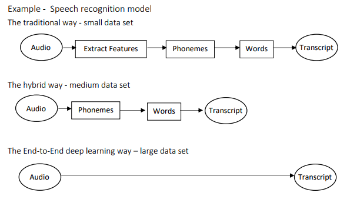
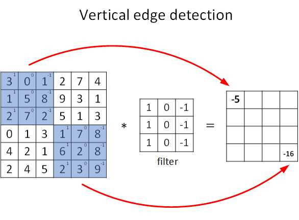
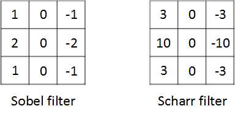
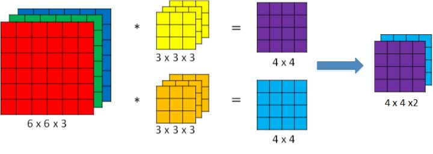
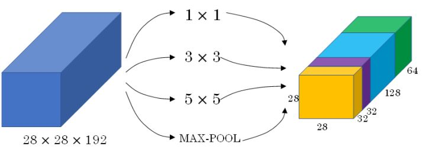
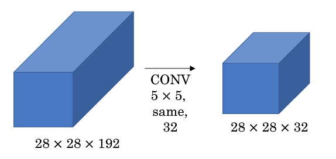
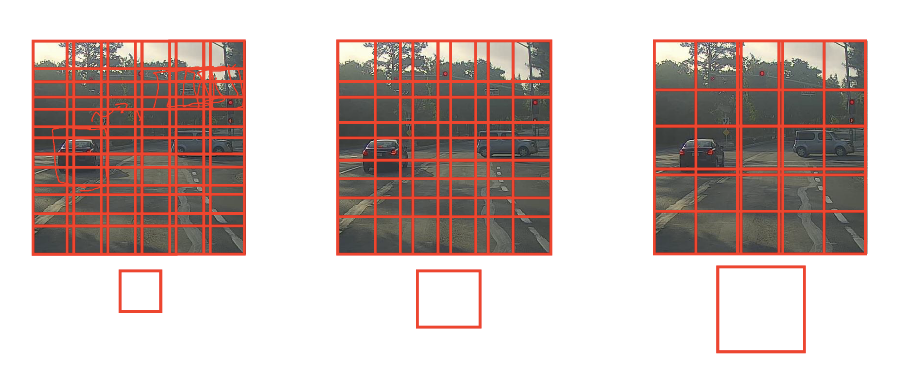
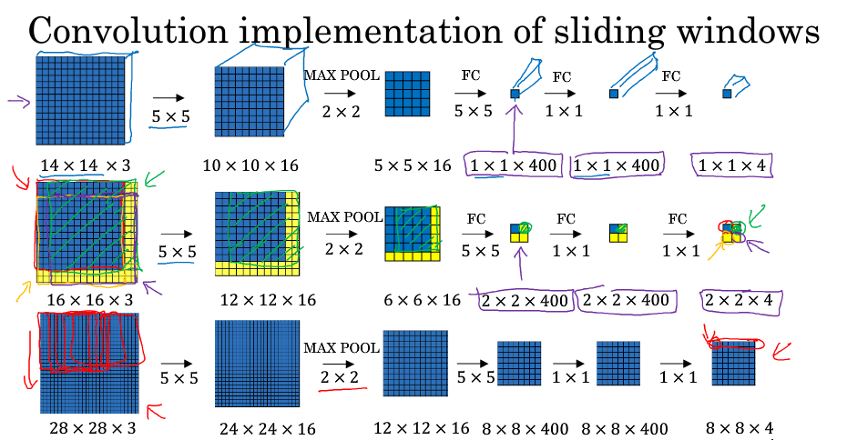
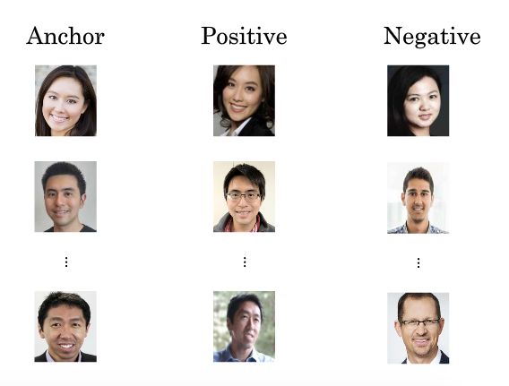
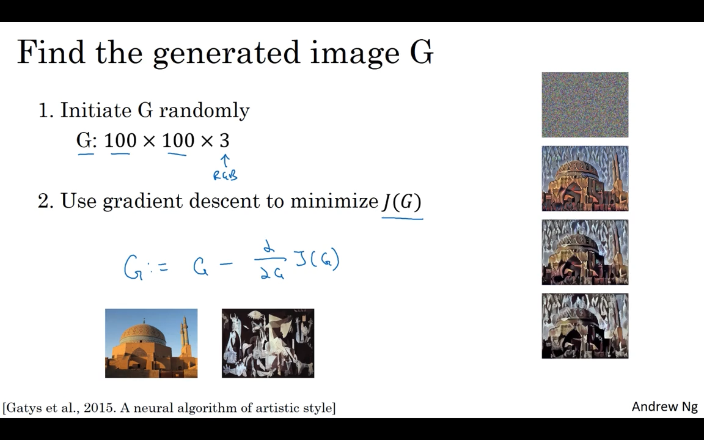

[TOC]

# PART3.结构化机器学习项目

## 一、机器学习策略（1）

对于一个已经被构建好且产生初步结果的机器学习系统，为了能使结果更令人满意，往往还要进行大量的改进。鉴于之前的课程介绍了多种改进的方法，例如收集更多数据、调试超参数、调整神经网络的大小或结构、采用不同的优化算法、进行正则化等等，我们有可能浪费大量时间在一条错误的改进路线上。

想要找准改进的方向，使一个机器学习系统更快更有效地工作，就需要学习一些在构建机器学习系统时常用到的策略。

### 正交化

**正交化**的核心在于每次调整只会影响模型某一方面的性能，而对其他功能没有影响。这种方法有助于更快更有效地进行机器学习模型的调试和优化。

在机器学习（监督学习）系统中，可以划分四个“功能”：

1. 建立的模型在训练集上表现良好；
2. 建立的模型在验证集上表现良好；
3. 建立的模型在测试集上表现良好；
4. 建立的模型在实际应用中表现良好。

其中，

* 对于第一条，如果模型在训练集上表现不好，可以尝试训练更大的神经网络或者换一种更好的优化算法（例如 Adam）；
* 对于第二条，如果模型在验证集上表现不好，可以进行正则化处理或者加入更多训练数据；
* 对于第三条，如果模型在测试集上表现不好，可以尝试使用更大的验证集进行验证（验证集过拟合）；
* 对于第四条，如果模型在实际应用中表现不好，可能是因为测试集没有设置正确或者成本函数评估指标有误，需要改变测试集或成本函数。

面对遇到的各种问题，正交化能够帮助我们更为精准有效地解决问题。

一个反例是早停止法（将训练集和验证集进行梯度下降时的成本变化曲线画在同一个坐标轴内，当训练集误差降低但验证集误差升高，两者开始发生较大偏差时及时停止迭代，并返回具有最小验证集误差的连接权和阈值，以避免过拟合。这种方法的缺点是无法同时达成偏差和方差的最优）。如果早期停止，虽然可以改善验证集的拟合表现，但是对训练集的拟合就不太好。因为对两个不同的“功能”都有影响，所以早停止法不具有正交化。虽然也可以使用，但是用其他正交化控制手段来进行优化会更简单有效。

### 单值评价指标

构建机器学习系统时，通过设置一个量化的**单值评价指标**，可以使我们根据这一指标比较不同超参数对应的模型的优劣，从而选择最优的那个模型。

例如，对于二分类问题，常用的评价指标是**精确率（Precision）**和**召回率（Recall）**。假设我们有 A 和 B 两个分类器，其两项指标分别如下：

* 精确率：$\frac{预测为正类的正类数量}{预测为正类的数量} * 100\%$

* 召回率：$\frac{预测为正类的正类数量}{正类数量} * 100\%$

实际应用中，我们通常使用综合了精确率和召回率的单值评价指标 F1 Score 来评价模型的好坏。F1 Score 其实就是精准率和召回率的**调和平均数**，比单纯的平均数效果要好。

$$F1 = \frac{2}{\frac{1}{P}+\frac{1}{R}} = \frac{2PR}{P+R}$$

因此，我们计算出两个分类器的 F1 Score。可以看出 A 模型的效果要更好。

| 分类器 | 精确率 | 召回率 | F1 Score |
| :----: | :----: | :----: | :------: |
|   A    |  95%   |  90%   |  92.4%   |
|   B    |  98%   |  85%   |  91.0%   |

通过引入单值评价指标，我们可以更方便快速地对不同模型进行比较。

### 优化指标和满足指标

如果我们还想要将分类器的运行时间也纳入考虑范围，将其和精确率、召回率组合成一个单值评价指标显然不那么合适。这时，我们可以将某些指标作为**优化指标**，寻求它们的最优值；而将某些指标作为**满足指标**，只要在一定阈值以内即可。

在这个例子中，准确率就是一个优化指标，因为我们想要分类器尽可能做到正确分类；而运行时间就是一个满足指标，如果你想要分类器的运行时间不多于某个阈值，那最终选择的分类器就应该是以这个阈值为界里面准确率最高的那个。

### 训练 / 验证 / 测试集划分

我们一般将数据集分为训练集、验证集、测试集。构建机器学习系统时，我们采用不同的学习方法，在**训练集**上训练出不同的模型，然后使用**验证集**对模型的好坏进行评估，确信其中某个模型足够好时再用**测试集**对其进行测试。

因此，训练集、验证集、测试集的设置对于机器学习模型非常重要，合理的设置能够大大提高模型训练效率和模型质量。

### 验证集和测试集的分布

验证集和测试集的数据来源应该相同（来自同一分布）、和机器学习系统将要在实际应用中面对的数据一致，且必须从所有数据中随机抽取。这样，系统才能做到尽可能不偏离目标。

### 验证集和测试集的大小

过去数据量较小（小于 1 万）时，通常将数据集按照以下比例进行划分：

* 无验证集的情况：70% / 30%；
* 有验证集的情况：60% / 20% / 20%；

这是为了保证验证集和测试集有足够的数据。现在的机器学习时代数据集规模普遍较大，例如 100 万数据量，这时将相应比例设为 98% / 1% / 1% 或 99% / 1% 就已经能保证验证集和测试集的规模足够。

测试集的大小应该设置得足够提高系统整体性能的可信度，验证集的大小也要设置得足够用于评估几个不同的模型。应该根据实际情况对数据集灵活地进行划分，而不是死板地遵循老旧的经验/

### 动态改变评价指标

对于模型的评价标准优势需要根据实际情况进行动态调整，以让模型在实际应用中获得更好的效果。

例如，有时我们不太能接受某些分类错误，于是改变单纯用错误率作为评价标准，给某些分类错误更高的权重，以从追求最小错误率转为追求最小风险。

### 比较人类表现水平

很多机器学习模型的诞生是为了取代人类的工作，因此其表现也会跟人类表现水平作比较。

上图展示了随着时间的推进，机器学习系统和人的表现水平的变化。一般的，当机器学习超过人的表现水平后，它的进步速度逐渐变得缓慢，最终性能无法超过某个理论上限，这个上限被称为**贝叶斯最优误差**。

贝叶斯最优误差一般认为是理论上可能达到的最优误差，换句话说，其就是理论最优函数，任何从 x 到精确度 y 映射的函数都不可能超过这个值。例如，对于语音识别，某些音频片段嘈杂到基本不可能知道说的是什么，所以完美的识别率不可能达到 100%。

因为人类对于一些自然感知问题的表现水平十分接近贝叶斯最优误差，所以当机器学习系统的表现超过人类后，就没有太多继续改善的空间了。

也因此，只要建立的机器学习模型的表现还没达到人类的表现水平时，就可以通过各种手段来提升它。例如采用人工标记过的数据进行训练，通过人工误差分析了解为什么人能够正确识别，或者是进行偏差、方差分析。

当模型的表现超过人类后，这些手段起的作用就微乎其微了。

### 可避免偏差

通过与贝叶斯最优误差，或者说，与人类表现水平的比较，可以表明一个机器学习模型表现的好坏程度，由此判断后续操作应该注重于减小偏差还是减小方差。

模型在**训练集**上的误差与人类表现水平的差值被称作**可避免偏差**。可避免偏差低便意味着模型在训练集上的表现很好，而**训练集与验证集之间错误率的差值**越小，意味着模型在验证集与测试集上的表现和训练集同样好。

如果**可避免偏差**大于**训练集与验证集之间错误率的差值**，之后的工作就应该专注于减小偏差；反之，就应该专注于减小方差。

### 理解人类表现水平

我们一般用**人类水平误差**来代表贝叶斯最优误差（或者简称贝叶斯误差）。对于不同领域的例子，不同人群由于其经验水平不一，错误率也不同。一般来说，**我们将表现最好的作为人类水平误差**。但是实际应用中，不同人选择人类水平误差的基准是不同的，这会带来一定的影响。

例如，如果某模型在训练集上的错误率为 0.7%，验证集的错误率为 0.8%。如果选择的人类水平误差为 0.5%，那么偏差比方差更加突出；而如果选择的人类水平误差为 0.7%，则方差更加突出。也就是说，根据人类水平误差的不同选择，我们可能因此选择不同的优化操作。

这种问题只会发生在模型表现很好，接近人类水平误差的时候才会出现。人类水平误差给了我们一种估计贝叶斯误差的方式，而不是像之前一样将训练的错误率直接对着 0% 的方向进行优化。

当机器学习模型的表现超过了人类水平误差时，很难再通过人的直觉去判断模型还能够往什么方向优化以提高性能。

### 总结

想让一个监督学习算法达到使用程度，应该做到以下两点：

1. 算法对训练集的拟合很好，可以看作可避免偏差很低；
2. 推广到验证集和测试集效果也很好，即方差不是很大。

根据正交化的思想，我们有一些措施可以独立地优化二者之一。

## 二、机器学习（ML）策略（2）

### 错误分析

通过人工检查机器学习模型得出的结果中出现的一些错误，有助于深入了解下一步要进行的工作。这个过程被称作**错误分析**。

例如，你可能会发现一个猫图片识别器错误地将一些看上去像猫的狗误识别为猫。这时，立即盲目地去研究一个能够精确识别出狗的算法不一定是最好的选择，因为我们不知道这样做会对提高分类器的准确率有多大的帮助。

这时，我们可以从分类错误的样本中统计出狗的样本数量。根据狗样本所占的比重来判断这一问题的重要性。假如狗类样本所占比重仅为 5%，那么即使花费几个月的时间来提升模型对狗的识别率，改进后的模型错误率并没有显著改善；而如果错误样本中狗类所占比重为 50%，那么改进后的模型性能会有较大的提升。因此，花费更多的时间去研究能够精确识别出狗的算法是值得的。

这种人工检查看似简单而愚笨，但却是十分必要的，因为这项工作能够有效避免花费大量的时间与精力去做一些对提高模型性能收效甚微的工作，让我们专注于解决影响模型准确率的主要问题。

在对输出结果中分类错误的样本进行人工分析时，可以建立一个表格来记录每一个分类错误的具体信息，例如某些图像是模糊的，或者是把狗识别成了猫等，并统计属于不同错误类型的错误数量。这样，分类结果会更加清晰。

总结一下，进行错误分析时，你应该观察错误标记的例子，看看假阳性和假阴性，统计属于不同错误类型的错误数量。在这个过程中，你可能会得到启发，归纳出新的错误类型。总之，通过统计不同错误标记类型占总数的百分比，有助于发现哪些问题亟待解决，或者提供构思新优化方向的灵感。

### 修正错误标记

而在做误差分析时，有时会注意到数据集中有些样本被人为地错误标记（incorrectly labeled）了，这时该怎么做？

如果是在训练集中，由于机器学习算法对于随机误差的**稳健性**（也称作“鲁棒性”），只要这些出错的样本数量较小，且分布近似随机，就不必花费时间一一修正。

而如果出现在验证集或者测试集，则可以在进行误差分析时，通过统计人为标记错误所占的百分比，来大致分析这种情况对模型的识别准确率的影响，并比较该比例的大小和其他错误类型的比例，以此判断是否值得去将错误的标记一一进行修正，还是可以忽略。

当你决定在验证集和测试集上手动检查标签并进行修正时，有一些额外的方针和原则需要考虑：

* 在验证集和测试集上**同时使用同样的修正手段**，以保证验证集和测试集来自相同的分布；
* 同时检查判断正确和判断错误的例子（通常不用这么做）；
* 在修正验证集和测试集时，鉴于训练集的分布不必和验证/测试集完全相同，可以不去修正训练集。

### 快速搭建系统并迭代

对于每个可以改善模型的合理方向，如何选择一个方向集中精力处理成了问题。如果想搭建一个全新的机器学习系统，建议根据以下步骤快速搭建好第一个系统，然后开始迭代：

1. 设置好训练、验证、测试集及衡量指标，确定目标；
2. 快速训练出一个初步的系统，用训练集来拟合参数，用验证集调参，用测试集评估；
3. 通过偏差/方差分析以及错误分析等方法，决定下一步优先处理的方向。

### 在不同的分布上训练和测试

有时，我们很难得到来自同一个分布的训练集和验证/测试集。还是以猫识别作为例子，我们的训练集可能由网络爬取得到，图片比较清晰，而且规模较大（例如 20 万）；而验证/测试集可能来自用户手机拍摄，图片比较模糊，且数量较少（例如 1 万），难以满足作为训练集时的规模需要。

虽然验证/测试集的质量不高，但是机器学习模型最终主要应用于识别这些用户上传的模糊图片。考虑到这一点，在划分数据集时，可以将 20 万张网络爬取的图片和 5000 张用户上传的图片作为训练集，而将剩下的 5000 张图片一半作验证集，一半作测试集。比起混合数据集所有样本再随机划分，这种分配方法虽然使训练集分布和验证/测试集的分布并不一样，但是能保证**验证/测试集更接近实际应用场景**，在长期能带来更好的系统性能。

### 数据不匹配

之前的学习中，我们通过比较人类水平误差、训练集错误率、验证集错误率的相对差值来判断进行偏差/方差分析。但在训练集和验证/测试集分布不一致的情况下，无法根据相对差值来进行偏差/方差分析。这是因为训练集错误率和验证集错误率的差值可能来自于算法本身（归为方差），也可能来自于样本分布不同，和模型关系不大。

在可能存在训练集和验证/测试集分布不一致的情况下，为了解决这个问题，我们可以再定义一个**训练-验证集**。训练-验证集和训练集的分布相同（或者是训练集分割出的子集），但是不参与训练过程。

现在，我们有了训练集错误率、训练-验证集错误率，以及验证集错误率。其中，*训练集*错误率和*训练-验证集*错误率的差值反映了方差；而*训练-验证集*错误率和*验证集*错误率的差值反映了样本分布不一致的问题，从而说明**模型擅长处理的数据和我们关心的数据来自不同的分布**，我们称之为**数据不匹配**问题。

人类水平误差、*训练集*错误率、*训练-验证集*错误率、*验证集*错误率、*测试集*错误率之间的差值所反映的问题如下图所示：

### 处理方法

这里有两条关于如何解决数据不匹配问题的建议：

* 做错误分析，尝试了解训练集和验证/测试集的具体差异（主要是人工查看训练集和验证集的样本）；
* 尝试将训练数据调整得更像验证集，或者收集更多类似于验证/测试集的数据。

如果你打算将训练数据调整得更像验证集，可以使用的一种技术是**人工合成数据**。我们以语音识别问题为例，实际应用场合（验证/测试集）是包含背景噪声的，而作为训练样本的音频很可能是清晰而没有背景噪声的。为了让训练集与验证/测试集分布一致，我们可以给训练集人工添加背景噪声，合成类似实际场景的声音。

人工合成数据能够使数据集匹配，从而提升模型的效果。但需要注意的是，不能给每段语音都增加同一段背景噪声，因为这样模型会对这段背景噪音出现过拟合现象，使得效果不佳。

### 迁移学习

**迁移学习**是通过将已训练好的神经网络模型的一部分网络结构应用到另一模型，将一个神经网络从某个任务中学到的知识和经验运用到另一个任务中，以显著提高学习任务的性能。

例如，我们将为猫识别器构建的神经网络迁移应用到放射科诊断中。因为猫识别器的神经网络已经学习到了有关图像的结构和性质等方面的知识，所以只要先删除神经网络中原有的输出层，加入新的输出层并随机初始化权重系数（$W^{[L]}$、$b^{[L]}$），随后用新的训练集进行训练，就完成了以上的迁移学习。

如果新的数据集很小，可能只需要重新训练输出层前的最后一层的权重，即$W^{[L]}$、$b^{[L]}$，并保持其他参数不变；而如果有足够多的数据，可以只保留网络结构，重新训练神经网络中所有层的系数。这时初始权重由之前的模型训练得到，这个过程称为**预训练**，之后的权重更新过程称为**微调**。

你也可以不止加入一个新的输出层，而是多向神经网络加几个新层。

在下述场合进行迁移学习是有意义的：

1. 两个任务有同样的输入（比如都是图像或者都是音频）；
2. **拥有更多数据的任务迁移到数据较少的任务**；
3. 某一任务的低层次特征（底层神经网络的某些功能）对另一个任务的学习有帮助。

### 多任务学习

迁移学习中的步骤是串行的；而**多任务学习**使用单个神经网络模型，利用共享表示采用并行训练同时学习多个任务。多任务学习的基本假设是**多个任务之间具有相关性**，并且任务之间可以利用相关性相互促进。例如，属性分类中，抹口红和戴耳环有一定的相关性，单独训练的时候是无法利用这些信息，多任务学习则可以利用任务相关性联合提高多个属性分类的精度。

以汽车自动驾驶为例，需要实现的多任务是识别行人、车辆、交通标志和信号灯。如果在输入的图像中检测出车辆和交通标志，则输出的 y 为：$$y = \begin{bmatrix} 0 \\\ 1 \\\ 1 \\\ 0 \end{bmatrix}\quad$$

多任务学习模型的成本函数为：

其中，j 代表任务下标，总有 c 个任务。对应的损失函数为：

多任务学习中可能存在训练样本 Y 某些标签空白的情况，这不会影响多任务学习模型的训练。

多任务学习和 SoftMax 回归看上去有些类似，容易混淆。它们的区别是，SoftMax 回归的输出向量 y 中只有一个元素为 1；而多任务学习的输出向量 y 中可以有多个元素为 1。

在下述场合进行多任务学习是有意义的：

1. 训练的一组任务可以共用低层次特征；
2. *通常*，每个任务的数据量接近；
3. 能够训练一个足够大的神经网络，以同时做好所有的工作。多任务学习会降低性能的唯一情况（即和为每个任务训练单个神经网络相比性能更低的情况）是神经网络还不够大。

在多任务深度网络中，低层次信息的共享有助于减少计算量，同时共享表示层可以使得几个有共性的任务更好的结合相关性信息，任务特定层则可以单独建模任务特定的信息，实现共享信息和任务特定信息的统一。

在实践中，多任务学习的使用频率要远低于迁移学习。计算机视觉领域中的物体识别是一个多任务学习的例子。

### 端到端学习

在传统的机器学习分块模型中，每一个模块处理一种输入，然后其输出作为下一个模块的输入，构成一条流水线。而**端到端深度学习**只用一个单一的神经网络模型来实现所有的功能。它将所有模块混合在一起，只关心输入和输出。

如果数据量较少，传统机器学习分块模型所构成的流水线效果会很不错。但如果训练样本足够大，并且训练出的神经网络模型足够复杂，那么端到端深度学习模型的性能会比传统机器学习分块模型更好。

而如果数据集规模适中，还是可以使用流水线方法，但是可以混合端到端深度学习，通过神经网络绕过某些模块，直接输出某些特征。

### 优点与缺点

应用端到端学习的优点：

* 只要有足够多的数据，剩下的全部交给一个足够大的神经网络。比起传统的机器学习分块模型，可能更能捕获数据中的任何统计信息，而不需要用人类固有的认知（或者说，成见）来进行分析；
* 所需手工设计的组件更少，简化设计工作流程；

缺点：

* 需要大量的数据；
* 排除了可能有用的人工设计组件；

根据以上分析，决定一个问题是否应用端到端学习的**关键点**是：是否有足够的数据，支持能够直接学习从 x 映射到 y 并且足够复杂的函数

# PART4.卷积神经网络

## 一、卷积神经网络

### 计算机视觉

**计算机视觉**的高速发展标志着新型应用产生的可能，例如自动驾驶、人脸识别、创造新的艺术风格。人们对于计算机视觉的研究也催生了很多机算机视觉与其他领域的交叉成果。一般的计算机视觉问题包括以下几类：

* 图片分类；
* 目标检测；
* 神经风格转换。

应用计算机视觉时要面临的一个挑战是数据的输入可能会非常大。例如一张 1000x1000x3 的图片，神经网络输入层的维度将高达三百万，使得网络权重 W 非常庞大。这样会造成两个后果：

1. 神经网络结构复杂，数据量相对较少，容易出现过拟合；
2. 所需内存和计算量巨大。

因此，一般的神经网络很难处理蕴含着大量数据的图像。解决这一问题的方法就是使用**卷积神经网络**。

### 卷积运算

我们之前提到过，神经网络由浅层到深层，分别可以检测出图片的边缘特征、局部特征（例如眼睛、鼻子等），到最后面的一层就可以根据前面检测的特征来识别整体面部轮廓。这些工作都是依托卷积神经网络来实现的。

**卷积运算**是卷积神经网络最基本的组成部分。我们以边缘检测为例，来解释卷积是怎样运算的。

### 边缘检测

图片最常做的边缘检测有两类：**垂直边缘检测**和**水平边缘检测**。

图片的边缘检测可以通过与相应滤波器进行卷积来实现。以垂直边缘检测为例，原始图片尺寸为 6x6，中间的矩阵被称作**滤波器**，尺寸为 3x3，卷积后得到的图片尺寸为 4x4，得到结果如下（数值表示灰度，以左上角和右下角的值为例）：

可以看到，卷积运算的求解过程是从左到右，由上到下，每次在原始图片矩阵中取与滤波器同等大小的一部分，每一部分中的值与滤波器中的值对应相乘后求和，将结果组成一个矩阵。

下图对应一个垂直边缘检测的例子：

如果将最右边的矩阵当作图像，那么中间一段亮一些的区域对应最左边的图像中间的垂直边缘。

这里有另一个卷积运算的动态的例子，方便理解：

图中的`*`表示卷积运算符号。在计算机中这个符号表示一般的乘法，而在不同的深度学习框架中，卷积操作的 API 定义可能不同：

* 在 Python 中，卷积用`conv_forward()`表示；
* 在 Tensorflow 中，卷积用`tf.nn.conv2d()`表示；
* 在 keras 中，卷积用`Conv2D()`表示。

### 更多边缘检测的例子

如果将灰度图左右的颜色进行翻转，再与之前的滤波器进行卷积，得到的结果也有区别。实际应用中，这反映了由明变暗和由暗变明的两种渐变方式。可以对输出图片取绝对值操作，以得到同样的结果。

垂直边缘检测和水平边缘检测的滤波器如下所示：

其他常用的滤波器还有 Sobel 滤波器和 Scharr 滤波器。它们增加了中间行的权重，以提高结果的稳健性。

滤波器中的值还可以设置为**参数**，通过模型训练来得到。这样，神经网络使用反向传播算法可以学习到一些低级特征，从而实现对图片所有边缘特征的检测，而不仅限于垂直边缘和水平边缘。

### 填充

假设输入图片的大小为 $n \times n$，而滤波器的大小为 $f \times f$，则卷积后的输出图片大小为 $(n-f+1) \times (n-f+1)$。

这样就有两个问题：

* 每次卷积运算后，输出图片的尺寸缩小；
* 原始图片的角落、边缘区像素点在输出中采用较少，输出图片丢失边缘位置的很多信息。

为了解决这些问题，可以在进行卷积操作前，对原始图片在边界上进行**填充**，以增加矩阵的大小。通常将 0 作为填充值。

设每个方向扩展像素点数量为 $p$，则填充后原始图片的大小为 $(n+2p) \times (n+2p)$，滤波器大小保持 $f \times f$不变，则输出图片大小为 $(n+2p-f+1) \times (n+2p-f+1)$。

因此，在进行卷积运算时，我们有两种选择：

* **Valid 卷积**：不填充，直接卷积。结果大小为 $(n-f+1) \times (n-f+1)$；
* **Same 卷积**：进行填充，并使得卷积后结果大小与输入一致，这样 $p = \frac{f-1}{2}$。

在计算机视觉领域，$f$通常为奇数。原因包括 Same 卷积中 $p = \frac{f-1}{2}$能得到自然数结果，并且滤波器有一个便于表示其所在位置的中心点。

### 卷积步长

卷积过程中，有时需要通过填充来避免信息损失，有时也需要通过设置**步长**来压缩一部分信息。

步长表示滤波器在原始图片的水平方向和垂直方向上每次移动的距离。之前，步长被默认为 1。而如果我们设置步长为 2，则卷积过程如下图所示：

设步长为 $s$，填充长度为 $p$，输入图片大小为 $n \times n$，滤波器大小为 $f \times f$，则卷积后图片的尺寸为：

$$\biggl\lfloor \frac{n+2p-f}{s}+1   \biggr\rfloor \times \biggl\lfloor \frac{n+2p-f}{s}+1 \biggr\rfloor$$

注意公式中有一个向下取整的符号，用于处理商不为整数的情况。向下取整反映着当取原始矩阵的图示蓝框完全包括在图像内部时，才对它进行运算。

目前为止我们学习的“卷积”实际上被称为**互相关**，而非数学意义上的卷积。真正的卷积操作在做元素乘积求和之前，要将滤波器沿水平和垂直轴翻转（相当于旋转 180 度）。因为这种翻转对一般为水平或垂直对称的滤波器影响不大，按照机器学习的惯例，我们通常不进行翻转操作，在简化代码的同时使神经网络能够正常工作。

### 高维卷积

如果我们想要对三通道的 RGB 图片进行卷积运算，那么其对应的滤波器组也同样是三通道的。过程是将每个单通道（R，G，B）与对应的滤波器进行卷积运算求和，然后再将三个通道的和相加，将 27 个乘积的和作为输出图片的一个像素值。

不同通道的滤波器可以不相同。例如只检测 R 通道的垂直边缘，G 通道和 B 通道不进行边缘检测，则 G 通道和 B 通道的滤波器全部置零。当输入有特定的高、宽和通道数时，滤波器可以有不同的高和宽，但通道数必须和输入一致。

如果想同时检测垂直和水平边缘，或者更多的边缘检测，可以增加更多的滤波器组。例如设置第一个滤波器组实现垂直边缘检测，第二个滤波器组实现水平边缘检测。设输入图片的尺寸为 $n \times n \times n\_c$（$n\_c$为通道数），滤波器尺寸为 $f \times f \times n\_c$，则卷积后的输出图片尺寸为 $(n-f+1) \times (n-f+1) \times n'\_c$，$n'\_c$为滤波器组的个数。

### 单层卷积网络

与之前的卷积过程相比较，卷积神经网络的单层结构多了激活函数和偏移量；而与标准神经网络：

$$Z^{[l]} = W^{[l]}A^{[l-1]}+b$$
$$A^{[l]} = g^{[l]}(Z^{[l]})$$

相比，滤波器的数值对应着权重 $W^{[l]}$，卷积运算对应着 $W^{[l]}$与 $A^{[l-1]}$的乘积运算，所选的激活函数变为 ReLU。

对于一个 3x3x3 的滤波器，包括偏移量 $b$在内共有 28 个参数。不论输入的图片有多大，用这一个滤波器来提取特征时，参数始终都是 28 个，固定不变。即**选定滤波器组后，参数的数目与输入图片的尺寸无关**。因此，卷积神经网络的参数相较于标准神经网络来说要少得多。这是 CNN 的优点之一。

### 符号总结

设 $l$ 层为卷积层：

* $f^{[l]}$：**滤波器的高（或宽）**
* $p^{[l]}$：**填充长度**
* $s^{[l]}$：**步长**
* $n^{[l]}\_c$：**滤波器组的数量**

* **输入维度**：$n^{[l-1]}\_H \times n^{[l-1]}\_W \times n^{[l-1]}\_c$ 。其中 $n^{[l-1]}\_H$表示输入图片的高，$n^{[l-1]}\_W$表示输入图片的宽。之前的示例中输入图片的高和宽都相同，但是实际中也可能不同，因此加上下标予以区分。

* **输出维度**：$n^{[l]}\_H \times n^{[l]}\_W \times n^{[l]}\_c$ 。其中

$$n^{[l]}\_H = \biggl\lfloor \frac{n^{[l-1]}\_H+2p^{[l]}-f^{[l]}}{s^{[l]}}+1   \biggr\rfloor$$

$$n^{[l]}\_W = \biggl\lfloor \frac{n^{[l-1]}\_W+2p^{[l]}-f^{[l]}}{s^{[l]}}+1   \biggr\rfloor$$

* **每个滤波器组的维度**：$f^{[l]} \times f^{[l]} \times n^{[l-1]}\_c$ 。其中$n^{[l-1]}\_c$ 为输入图片通道数（也称深度）。
* **权重维度**：$f^{[l]} \times f^{[l]} \times n^{[l-1]}\_c \times n^{[l]}\_c$
* **偏置维度**：$1 \times 1 \times 1 \times n^{[l]}\_c$

由于深度学习的相关文献并未对卷积标示法达成一致，因此不同的资料关于高度、宽度和通道数的顺序可能不同。有些作者会将通道数放在首位，需要根据标示自行分辨。

### 简单卷积网络示例

一个简单的 CNN 模型如下图所示：

其中，$a^{[3]}$的维度为 7x7x40，将 1960 个特征平滑展开成 1960 个单元的一列，然后连接最后一级的输出层。输出层可以是一个神经元，即二元分类；也可以是多个神经元，即多元分类。最后得到预测输出 $\hat y$。

随着神经网络计算深度不断加深，图片的高度和宽度 $n^{[l]}\_H $、$n^{[l]}\_W$一般逐渐减小，而 $n^{[l]}\_c$在增加。

一个典型的卷积神经网络通常包含有三种层：**卷积层、池化层、全连接层**。仅用卷积层也有可能构建出很好的神经网络，但大部分神经网络还是会添加池化层和全连接层，它们更容易设计。

### 池化层

**池化层**的作用是缩减模型的大小，提高计算速度，同时减小噪声提高所提取特征的稳健性。

采用较多的一种池化过程叫做**最大池化**。将输入拆分成不同的区域，输出的每个元素都是对应区域中元素的最大值，如下图所示：

池化过程类似于卷积过程，上图所示的池化过程中相当于使用了一个大小 $f=2$的滤波器，且池化步长 $s=2$。卷积过程中的几个计算大小的公式也都适用于池化过程。如果有多个通道，那么就对每个通道分别执行计算过程。

对最大池化的一种直观解释是，元素值较大可能意味着池化过程之前的卷积过程提取到了某些特定的特征，池化过程中的最大化操作使得只要在一个区域内提取到某个特征，它都会保留在最大池化的输出中。但是，没有足够的证据证明这种直观解释的正确性，而最大池化被使用的主要原因是它在很多实验中的效果都很好。

另一种池化过程是**平均池化**，就是从取某个区域的最大值改为求这个区域的平均值：

池化过程的特点之一是，它有一组超参数，但是并**没有参数需要学习**。池化过程的超参数包括滤波器的大小 $f$、步长 $s$，以及选用最大池化还是平均池化。而填充 $p$则很少用到。

池化过程的输入维度为：

$$n\_H \times n\_W \times n\_c$$

输出维度为：

$$\biggl\lfloor \frac{n\_H-f}{s}+1   \biggr\rfloor \times \biggl\lfloor \frac{n\_W-f}{s}+1   \biggr\rfloor \times n\_c$$

### 卷积神经网络示例

在计算神经网络的层数时，通常只统计具有权重和参数的层，因此池化层通常和之前的卷积层共同计为一层。

图中的 FC3 和 FC4 为全连接层，与标准的神经网络结构一致。整个神经网络各层的尺寸与参数如下表所示：

 | Activation shape | Activation Size | #parameters
**Input:** | (32, 32, 3) | 3072 | 0
**CONV1(f=5, s=1)** | (28, 28, 6) | 4704 | 208
**POOL1** | (14, 14, 6) | 1176 | 0
**CONV2(f=5, s=1)** | (10, 10, 16) | 1600 | 416
**POOL2** | (5, 5, 16) | 400 | 0
**FC3** | (120, 1) | 120 | 48001
**FC4** | (84, 1) | 84 | 10081
**Softmax** | (10, 1) | 10 | 841

### 使用卷积的原因

相比标准神经网络，对于大量的输入数据，卷积过程有效地减少了 CNN 的参数数量，原因有以下两点：

* **参数共享**：特征检测如果适用于图片的某个区域，那么它也可能适用于图片的其他区域。即在卷积过程中，不管输入有多大，一个特征探测器（滤波器）就能对整个输入的某一特征进行探测。
* **稀疏连接**：在每一层中，由于滤波器的尺寸限制，输入和输出之间的连接是稀疏的，每个输出值只取决于输入在局部的一小部分值。

池化过程则在卷积后很好地聚合了特征，通过降维来减少运算量。

由于 CNN 参数数量较小，所需的训练样本就相对较少，因此在一定程度上不容易发生过拟合现象。并且 CNN 比较擅长捕捉区域位置偏移。即进行物体检测时，不太受物体在图片中位置的影响，增加检测的准确性和系统的健壮性。

## 二、 深度卷积网络：实例探究

讲到的经典 CNN 模型包括：

* LeNet-5
* AlexNet
* VGG

此外还有 ResNet（Residual Network，残差网络），以及 Inception Neural Network。

### 经典卷积网络

### LeNet-5

特点：

* LeNet-5 针对灰度图像而训练，因此输入图片的通道数为 1。
* 该模型总共包含了约 6 万个参数，远少于标准神经网络所需。
* 典型的 LeNet-5 结构包含卷积层（CONV layer），池化层（POOL layer）和全连接层（FC layer），排列顺序一般为 CONV layer->POOL layer->CONV layer->POOL layer->FC layer->FC layer->OUTPUT layer。一个或多个卷积层后面跟着一个池化层的模式至今仍十分常用。
* 当 LeNet-5模型被提出时，其池化层使用的是平均池化，而且各层激活函数一般选用 Sigmoid 和 tanh。现在，我们可以根据需要，做出改进，使用最大池化并选用 ReLU 作为激活函数。

### AlexNet

特点：

* AlexNet 模型与 LeNet-5 模型类似，但是更复杂，包含约 6000 万个参数。另外，AlexNet 模型使用了 ReLU 函数。
* 当用于训练图像和数据集时，AlexNet 能够处理非常相似的基本构造模块，这些模块往往包含大量的隐藏单元或数据。

### VGG

特点：

* VGG 又称 VGG-16 网络，“16”指网络中包含 16 个卷积层和全连接层。
* 超参数较少，只需要专注于构建卷积层。
* 结构不复杂且规整，在每一组卷积层进行滤波器翻倍操作。
* VGG 需要训练的特征数量巨大，包含多达约 1.38 亿个参数。

### 残差网络

因为存在梯度消失和梯度爆炸问题，网络越深，就越难以训练成功。**残差网络**可以有效解决这个问题。

上图的结构被称为**残差块**。通过**捷径（跳远连接）**可以将 $a^{[l]}$添加到第二个 ReLU 过程中，直接建立 $a^{[l]}$与 $a^{[l+2]}$之间的隔层联系。表达式如下：

$$z^{[l+1]} = W^{[l+1]}a^{[l]} + b^{[l+1]}$$

$$a^{[l+1]} = g(z^{[l+1]})$$

$$z^{[l+2]} = W^{[l+2]}a^{[l+1]} + b^{[l+2]}$$

$$a^{[l+2]} = g(z^{[l+2]} + a^{[l]})$$

构建一个残差网络就是将许多残差块堆积在一起，形成一个深度网络。

为了便于区分，在 ResNets 的论文[He et al., 2015. Deep residual networks for image recognition](https://arxiv.org/pdf/1512.03385.pdf)中，非残差网络被称为**普通网络**。将它变为残差网络的方法是加上所有的跳远连接。

在理论上，随着网络深度的增加，性能应该越来越好。但实际上，对于一个普通网络，随着神经网络层数增加，训练错误会先减少，然后开始增多。但残差网络的训练效果显示，即使网络再深，其在训练集上的表现也会越来越好。

残差网络有助于解决梯度消失和梯度爆炸问题，使得在训练更深的网络的同时，又能保证良好的性能。

### 残差网络有效的原因

假设有一个大型神经网络，其输入为 $X$，输出为 $a^{[l]}$。给这个神经网络额外增加两层，输出为 $a^{[l+2]}$。将这两层看作一个具有跳远连接的残差块。为了方便说明，假设整个网络中都选用 ReLU 作为激活函数，因此输出的所有激活值都大于等于 0。

则有：

$$
\begin{equation}
\begin{split}
 a^{[l+2]} &= g(z^{[l+2]}+a^{[l]})  
     \\\ &= g(W^{[l+2]}a^{[l+1]}+b^{[l+2]}+a^{[l]})
\end{split}
\end{equation}
$$

当发生梯度消失时，$W^{[l+2]}\approx0$，$b^{[l+2]}\approx0$，则有：

$$a^{[l+2]} = g(a^{[l]}) = ReLU(a^{[l]}) = a^{[l]}$$

因此，这两层额外的残差块不会降低网络性能。而如果没有发生梯度消失时，训练得到的非线性关系会使得表现效果进一步提高。

注意，如果 $a^{[l]}$与 $a^{[l+2]}$的维度不同，需要引入矩阵 $W\_s$与 $a^{[l]}$相乘，使得二者的维度相匹配。参数矩阵 $W\_s$既可以通过模型训练得到，也可以作为固定值，仅使 $a^{[l]}$截断或者补零。

上图是论文提供的 CNN 中 ResNet 的一个典型结构。卷积层通常使用 Same 卷积以保持维度相同，而不同类型层之间的连接（例如卷积层和池化层），如果维度不同，则需要引入矩阵 $W\_s$。

### 1x1 卷积

1x1 卷积（1x1 convolution，或称为 Network in Network）指滤波器的尺寸为 1。当通道数为 1 时，1x1 卷积意味着卷积操作等同于乘积操作。

而当通道数更多时，1x1 卷积的作用实际上类似全连接层的神经网络结构，从而降低（或升高，取决于滤波器组数）数据的维度。

池化能压缩数据的高度（$n\_H$）及宽度（$n\_W$），而 **1×1 卷积能压缩数据的通道数**（$n\_C$）。在如下图所示的例子中，用 32 个大小为 1×1×192 的滤波器进行卷积，就能使原先数据包含的 192 个通道压缩为 filters个。

虽然论文[Lin et al., 2013. Network in network](https://arxiv.org/pdf/1312.4400.pdf)中关于架构的详细内容并没有得到广泛应用，但是 1x1 卷积的理念十分有影响力，许多神经网络架构（包括 Inception 网络）都受到它的影响。

### Inception 网络

在之前的卷积网络中，我们只能选择单一尺寸和类型的滤波器。而 **Inception 网络的作用**即是代替人工来确定卷积层中的滤波器尺寸与类型，或者确定是否需要创建卷积层或池化层。

如图，Inception 网络选用不同尺寸的滤波器进行 Same 卷积，并将卷积和池化得到的输出组合拼接起来，最终让网络自己去学习需要的参数和采用的滤波器组合。

### 计算成本问题

在提升性能的同时，Inception 网络有着较大的计算成本。下图是一个例子：

图中有 32 个滤波器，每个滤波器的大小为 5x5x192。输出大小为 28x28x32，所以需要计算 28x28x32 个数字，对于每个数，都要执行 5x5x192 次乘法运算。加法运算次数与乘法运算次数近似相等。因此，可以看作这一层的计算量为 28x28x32x5x5x192 = 1.2亿。

为了解决计算量大的问题，可以引入 1x1 卷积来减少其计算量。

对于同一个例子，我们使用 1x1 卷积把输入数据从 192 个通道减少到 16 个通道，然后对这个较小层运行 5x5 卷积，得到最终输出。这个 1x1 的卷积层通常被称作**瓶颈层**。

改进后的计算量为 28x28x192x16 + 28x28x32x5x5x15 = 1.24 千万，减少了约 90%。

只要合理构建瓶颈层，就可以既显著缩小计算规模，又不会降低网络性能。

### 完整的 Inception 网络

上图是引入 1x1 卷积后的 Inception 模块。值得注意的是，为了将所有的输出组合起来，红色的池化层使用 Same 类型的填充（padding）来池化使得输出的宽高不变，通道数也不变。

多个 Inception 模块组成一个完整的 Inception 网络（被称为 GoogLeNet，以向 LeNet 致敬），如下图所示：

注意黑色椭圆圈出的隐藏层，这些分支都是 Softmax 的输出层，可以用来参与特征的计算及结果预测，起到调整并防止发生过拟合的效果。

经过研究者们的不断发展，Inception 模型的 V2、V3、V4 以及引入残差网络的版本被提出，这些变体都基于 Inception V1 版本的基础思想上。顺便一提，Inception 模型的名字来自电影《盗梦空间》。

### 使用开源的实现方案

很多神经网络复杂细致，并充斥着参数调节的细节问题，因而很难仅通过阅读论文来重现他人的成果。想要搭建一个同样的神经网络，查看开源的实现方案会快很多。

### 迁移学习

在“搭建机器学习项目”课程中，迁移学习已经被提到过。计算机视觉是一个经常用到迁移学习的领域。在搭建计算机视觉的应用时，相比于从头训练权重，下载别人已经训练好的网络结构的权重，用其做**预训练**，然后转换到自己感兴趣的任务上，有助于加速开发。

对于已训练好的卷积神经网络，可以将所有层都看作是**冻结的**，只需要训练与你的 Softmax 层有关的参数即可。大多数深度学习框架都允许用户指定是否训练特定层的权重。

而冻结的层由于不需要改变和训练，可以看作一个固定函数。可以将这个固定函数存入硬盘，以便后续使用，而不必每次再使用训练集进行训练了。

上述的做法适用于你只有一个较小的数据集。如果你有一个更大的数据集，应该冻结更少的层，然后训练后面的层。越多的数据意味着冻结越少的层，训练更多的层。如果有一个极大的数据集，你可以将开源的网络和它的权重整个当作初始化（代替随机初始化），然后训练整个网络。

### 数据扩增

计算机视觉领域的应用都需要大量的数据。当数据不够时，**数据扩增**就有帮助。常用的数据扩增包括镜像翻转、随机裁剪、色彩转换。

其中，色彩转换是对图片的 RGB 通道数值进行随意增加或者减少，改变图片色调。另外，**PCA 颜色增强**指更有针对性地对图片的 RGB 通道进行主成分分析，对主要的通道颜色进行增加或减少，可以采用高斯扰动做法来增加有效的样本数量。具体的 PCA 颜色增强做法可以查阅 AlexNet 的相关论文或者开源代码。

在构建大型神经网络的时候，数据扩增和模型训练可以由两个或多个不同的线程并行来实现。

### 计算机视觉现状

通常，学习算法有两种知识来源：

* 被标记的数据
* 手工工程

**手工工程**指精心设计的特性、网络体系结构或是系统的其他组件。手工工程是一项非常重要也比较困难的工作。在数据量不多的情况下，手工工程是获得良好表现的最佳方式。正因为数据量不能满足需要，历史上计算机视觉领域更多地依赖于手工工程。近几年数据量急剧增加，因此手工工程量大幅减少。

另外，在模型研究或者竞赛方面，有一些方法能够有助于提升神经网络模型的性能：

* 集成：独立地训练几个神经网络，并平均输出它们的输出
* Multi-crop at test time：将数据扩增应用到测试集，对结果进行平均

但是由于这些方法计算和内存成本较大，一般不适用于构建实际的生产项目。

### 补充：经典卷积网络的意义

LeNet-5

- LeNet-5是LeNet系列的最终稳定版,它被美国银行用于手写数字识别

- 在卷积神经网络中，我们组合使用卷积层、非线性激活函数和汇聚层。
- 为了构造高性能的卷积神经网络，我们通常对卷积层进行排列，逐渐降低其表示的空间分辨率，同时增加通道数。
- 在传统的卷积神经网络中，卷积块编码得到的表征在输出之前需由一个或多个全连接层进行处理。

AlexNet

因为虽然 LeNet 在小数据集上取得了很好的效果，但是在更大、更真实的数据集上训练卷积神经网络的性能和可行性还有待进一步提升。

AlexNet是第一个在大规模视觉竞赛中击败传统计算机视觉模型的大型神经网络。

- AlexNet的结构与LeNet相似，但使用了更多的卷积层和更多的参数来拟合大规模的ImageNet数据集。
- 今天，AlexNet已经被更有效的结构所超越，但它是从浅层网络到深层网络的关键一步。
- 尽管AlexNet的代码只比LeNet多出几行，但学术界花了很多年才接受深度学习这一概念，并应用其出色的实验结果。
- Dropout、ReLU和预处理是提升计算机视觉任务性能的其他关键步骤。

VGG 

虽然 AlexNet 证明深层神经网络卓有成效，但它没有提供一个通用的模板来指导后续的研究人员设计新的网络。 在下面的网络中，将介绍一些常用于设计深层神经网络的启发式概念。

使用块的想法首先出现在牛津大学的视觉几何组（visual geometry Group）(VGG)的VGG网络中。通过使用循环和子程序，可以很容易地在任何现代深度学习框架的代码中实现这些重复的结构。

- VGG 可以看作在 AlexNet 网络的基础上进行了改造，5个 stage 对应 AlexNet 中的5层卷积，3层全连接仍然不变
- VGG-11 使用可复用的卷积块构造网络。不同的 VGG 模型可通过每个块中卷积层数量和输出通道数量的差异来定义。
- 块的使用导致网络定义的非常简洁。使用块可以有效地设计复杂的网络。
- 在VGG论文中，Simonyan和Ziserman尝试了各种架构。特别是他们发现深层且窄的卷积（即3×3）比较浅层且宽的卷积更有效。

GoogLeNet

在2014年的ImageNet图像识别挑战赛中，一个名叫*GoogLeNet*:cite:`Szegedy.Liu.Jia.ea.2015`的网络结构大放异彩。 GoogLeNet吸收了NiN中串联网络的思想，并在此基础上做了改进。 **这篇论文的一个重点是解决了什么样大小的卷积核最合适的问题。** 毕竟，以前流行的网络使用小到1×1，大到11×11的卷积核。 本文的一个观点是，有时使用不同大小的卷积核组合是有利的。

- Inception 块相当于一个有4条路径的子网络。它通过不同窗口形状的卷积层和最大汇聚层来并行抽取信息，并使用 1×1卷积层减少每像素级别上的通道维数从而降低模型复杂度。
- GoogLeNet将多个设计精细的Inception块与其他层（卷积层、全连接层）串联起来。其中Inception块的通道数分配之比是在 ImageNet 数据集上通过大量的实验得来的。
- GoogLeNet 和它的后继者们一度是 ImageNet 上最有效的模型之一：它以较低的计算复杂度提供了类似的测试精度。

ResNet

何恺明等人提出的*残差网络*在2015年的ImageNet图像识别挑战赛夺魁，并深刻影响了后来的深度神经网络的设计。 残差网络的核心思想是：每个附加层都应该更容易地包含原始函数作为其元素之一。在残差块中，输入可通过跨层数据线路更快地向前传播。

- 残差映射可以更容易地学习同一函数，例如将权重层中的参数近似为零。
- 利用残差块可以训练出一个有效的深层神经网络：输入可以通过层间的残余连接更快地向前传播。
- 残差网络对随后的深层神经网络设计产生了深远影响，无论是卷积类网络还是全连接类网络。

总结：

- AlexNet。它是第一个在大规模视觉竞赛中击败传统计算机视觉模型的大型神经网络；
- 使用重复块的网络（VGG）。它利用许多重复的神经网络块和小卷积核的有效性；
- 含并行连结的网络（GoogLeNet）。它使用并行连结的网络，通过不同窗口大小的卷积层和最大汇聚层来并行抽取信息；
- 残差网络（ResNet）。它通过残差块构建跨层的数据通道，是计算机视觉中最流行的体系结构；

## 三、 目标检测

目标检测是计算机视觉领域中一个新兴的应用方向，其任务是对输入图像进行分类的同时，检测图像中是否包含某些目标，并对他们准确定位并标识。

### 目标定位

定位分类问题不仅要求判断出图片中物体的种类，还要在图片中标记出它的具体位置，用**边框**把物体圈起来。一般来说，定位分类问题通常只有一个较大的对象位于图片中间位置；而在目标检测问题中，图片可以含有多个对象，甚至单张图片中会有多个不同分类的对象。

为了定位图片中汽车的位置，可以让神经网络多输出 4 个数字，标记为 $b\_x$、$b\_y$、$b\_h$、$b\_w$。将图片左上角标记为 (0, 0)，右下角标记为 (1, 1)，则有：

* 红色方框的中心点：($b\_x$，$b\_y$)
* 边界框的高度：$b\_h$
* 边界框的宽度：$b\_w$

因此，训练集不仅包含对象分类标签，还包含表示边界框的四个数字。定义目标标签 Y 如下：

$$\left[\begin{matrix}P\_c\\\ b\_x\\\ b\_y\\\ b\_h\\\ b\_w\\\ c\_1\\\ c\_2\\\ c\_3\end{matrix}\right]$$

则有：

$$P\_c=1, Y = \left[\begin{matrix}1\\\ b\_x\\\ b\_y\\\ b\_h\\\ b\_w\\\ c\_1\\\ c\_2\\\ c\_3\end{matrix}\right]
$$

其中，$c\_n$表示存在第 $n$个种类的概率；如果 $P\_c=0$，表示没有检测到目标，则输出标签后面的 7 个参数都是无效的，可以忽略（用 ? 来表示）。

$$P\_c=0, Y = \left[\begin{matrix}0\\\ ?\\\ ?\\\ ?\\\ ?\\\ ?\\\ ?\\\ ?\end{matrix}\right]$$

损失函数可以表示为 $L(\hat y, y)$，如果使用平方误差形式，对于不同的 $P\_c$有不同的损失函数（注意下标 $i$指标签的第 $i$个值）：

1. $P\_c=1$，即$y\_1=1$：

    $L(\hat y,y)=(\hat y\_1-y\_1)^2+(\hat y\_2-y\_2)^2+\cdots+(\hat y\_8-y\_8)^2$

2. $P\_c=0$，即$y\_1=0$：

    $L(\hat y,y)=(\hat y\_1-y\_1)^2$

除了使用平方误差，也可以使用逻辑回归损失函数，类标签 $c\_1,c\_2,c\_3$ 也可以通过 softmax 输出。相比较而言，平方误差已经能够取得比较好的效果。

### 特征点检测

神经网络可以像标识目标的中心点位置那样，通过输出图片上的特征点，来实现对目标特征的识别。在标签中，这些特征点以多个二维坐标的形式表示。

通过检测人脸特征点可以进行情绪分类与判断，或者应用于 AR 领域等等。也可以透过检测姿态特征点来进行人体姿态检测。

### 目标检测

想要实现目标检测，可以采用**基于滑动窗口的目标检测**算法。该算法的步骤如下：

1. 训练集上搜集相应的各种目标图片和非目标图片，样本图片要求尺寸较小，相应目标居于图片中心位置并基本占据整张图片。
2. 使用训练集构建 CNN 模型，使得模型有较高的识别率。
3. 选择大小适宜的窗口与合适的固定步幅，对测试图片进行从左到右、从上倒下的滑动遍历。每个窗口区域使用已经训练好的 CNN 模型进行识别判断。
4. 可以选择更大的窗口，然后重复第三步的操作。

滑动窗口目标检测的**优点**是原理简单，且不需要人为选定目标区域；**缺点**是需要人为直观设定滑动窗口的大小和步幅。滑动窗口过小或过大，步幅过大均会降低目标检测的正确率。另外，每次滑动都要进行一次 CNN 网络计算，如果滑动窗口和步幅较小，计算成本往往很大。

所以，滑动窗口目标检测算法虽然简单，但是性能不佳，效率较低。

### 基于卷积的滑动窗口实现

相比从较大图片多次截取，在卷积层上应用滑动窗口目标检测算法可以提高运行速度。所要做的仅是将全连接层换成卷积层，即使用与上一层尺寸一致的滤波器进行卷积运算。

如图，对于 16x16x3 的图片，步长为 2，CNN 网络得到的输出层为 2x2x4。其中，2x2 表示共有 4 个窗口结果。对于更复杂的 28x28x3 的图片，得到的输出层为 8x8x4，共 64 个窗口结果。最大池化层的宽高和步长相等。

运行速度提高的原理：在滑动窗口的过程中，需要重复进行 CNN 正向计算。因此，不需要将输入图片分割成多个子集，分别执行向前传播，而是将它们作为一张图片输入给卷积网络进行一次 CNN 正向计算。这样，公共区域的计算可以共享，以降低运算成本。

### 边框预测

在上述算法中，边框的位置可能无法完美覆盖目标，或者大小不合适，或者最准确的边框并非正方形，而是长方形。

**YOLO（You Only Look Once）算法**可以用于得到更精确的边框。YOLO 算法将原始图片划分为 n×n 网格，并将目标定位一节中提到的图像分类和目标定位算法，逐一应用在每个网格中，每个网格都有标签如：

$$\left[\begin{matrix}P\_c\\\ b\_x\\\ b\_y\\\ b\_h\\\ b\_w\\\ c\_1\\\ c\_2\\\ c\_3\end{matrix}\right]$$

若某个目标的中点落在某个网格，则该网格负责检测该对象。

如上面的示例中，如果将输入的图片划分为 3×3 的网格、需要检测的目标有 3 类，则每一网格部分图片的标签会是一个 8 维的列矩阵，最终输出的就是大小为 3×3×8 的结果。要得到这个结果，就要训练一个输入大小为 100×100×3，输出大小为 3×3×8 的 CNN。在实践中，可能使用更为精细的 19×19 网格，则两个目标的中点在同一个网格的概率更小。

YOLO 算法的优点：

1. 和图像分类和目标定位算法类似，显式输出边框坐标和大小，不会受到滑窗分类器的步长大小限制。
2. 仍然只进行一次 CNN 正向计算，效率很高，甚至可以达到实时识别。

如何编码边框 $b\_x$、$b\_y$、$b\_h$、$b\_w$？YOLO 算法设 $b\_x$、$b\_y$、$b\_h$、$b\_w$ 的值是相对于网格长的比例。则 $b\_x$、$b\_y$ 在 0 到 1 之间，而 $b\_h$、$b\_w$ 可以大于 1。当然，也有其他参数化的形式，且效果可能更好。这里只是给出一个通用的表示方法。

相关论文：[Redmon et al., 2015. You Only Look Once: Unified, Real-Time Object Detection](https://arxiv.org/pdf/1506.02640.pdf)。Ng 认为该论文较难。

### 交互比

**交互比（IoU）**函数用于评价对象检测算法，它计算预测边框和实际边框交集（I）与并集（U）之比：

$$IoU = \frac{I}{U}$$

IoU 的值在 0～1 之间，且越接近 1 表示目标的定位越准确。IoU 大于等于 0.5 时，一般可以认为预测边框是正确的，当然也可以更加严格地要求一个更高的阈值。

### 非极大值抑制

YOLO 算法中，可能有很多网格检测到同一目标。**非极大值抑制**会通过清理检测结果，找到每个目标中点所位于的网格，确保算法对每个目标只检测一次。

进行非极大值抑制的步骤如下：

1. 将包含目标中心坐标的可信度 $P\_c$ 小于阈值（例如 0.6）的网格丢弃；
2. 选取拥有最大 $P\_c$ 的网格；
3. 分别计算该网格和其他所有网格的 IoU，将 IoU 超过预设阈值的网格丢弃；
4. 重复第 2~3 步，直到不存在未处理的网格。

上述步骤适用于单类别目标检测。进行多个类别目标检测时，对于每个类别，应该单独做一次非极大值抑制。

### Anchor Boxes

到目前为止，我们讨论的情况都是一个网格只检测一个对象。如果要将算法运用在多目标检测上，需要用到 Anchor Boxes。一个网格的标签中将包含多个 Anchor Box，相当于存在多个用以标识不同目标的边框。

在上图示例中，我们希望同时检测人和汽车。因此，每个网格的的标签中含有两个 Anchor Box。输出的标签结果大小从 3×3×8 变为 3×3×16。若两个 $P\_c$ 都大于预设阈值，则说明检测到了两个目标。

在单目标检测中，图像中的目标被分配给了包含该目标中点的那个网格；引入 Anchor Box 进行多目标检测时，图像中的目标则被分配到了包含该目标中点的那个网格以及具有最高 IoU 值的该网格的 Anchor Box。

Anchor Boxes 也有局限性，对于同一网格有三个及以上目标，或者两个目标的 Anchor Box 高度重合的情况处理不好。

Anchor Box 的形状一般通过人工选取。高级一点的方法是用 k-means 将两类对象形状聚类，选择最具代表性的 Anchor Box。

### R-CNN 

前面介绍的滑动窗口目标检测算法对一些明显没有目标的区域也进行了扫描，这降低了算法的运行效率。为了解决这个问题，**R-CNN（Region CNN，带区域的 CNN）**被提出。通过对输入图片运行**图像分割算法**，在不同的色块上找出**候选区域（Region Proposal）**，就只需要在这些区域上运行分类器。

R-CNN 的缺点是运行速度很慢，所以有一系列后续研究工作改进。例如 Fast R-CNN（与基于卷积的滑动窗口实现相似，但得到候选区域的聚类步骤依然很慢）、Faster R-CNN（使用卷积对图片进行分割）。不过大多数时候还是比 YOLO 算法慢。

相关论文：

* R-CNN：[Girshik et al., 2013. Rich feature hierarchies for accurate object detection and semantic segmentation](https://arxiv.org/pdf/1311.2524.pdf)
* Fast R-CNN：[Girshik, 2015. Fast R-CNN](https://arxiv.org/pdf/1504.08083.pdf)
* Faster R-CNN：[Ren et al., 2016. Faster R-CNN: Towards real-time object detection with region proposal networks](https://arxiv.org/pdf/1506.01497v3.pdf)

RCNN优点
1.性能优越
RCNN实现高精度的检测性能。

2.两阶段网络
相较于其他一阶段的检测网络，两阶段的网络更加的精准，更加可以解决多尺度、小目标问题。

3.通用性和鲁棒性
RCNN在多个数据集上表现优秀，且容易进行迁移，对数据集中的目标类进行更改就可以很好的改变测试模型。

4.可优化点很多
对于实验的人员来说，该模型可以进行改进的地方很多，网络的算法的优化空间很大

5.代码全面
基于各种深度框架的RCNN代码都实现了开源，很方便使用

## 四、 特殊应用：人脸识别和神经风格转换

### 人脸识别

**人脸验证**和**人脸识别**的区别：

* 人脸验证：一般指一个一对一问题，只需要验证输入的人脸图像是否与某个已知的身份信息对应；
* 人脸识别：一个更为复杂的一对多问题，需要验证输入的人脸图像是否与多个已知身份信息中的某一个匹配。

一般来说，由于需要匹配的身份信息更多导致错误率增加，人脸识别比人脸验证更难一些。

### One-Shot 学习

人脸识别所面临的一个挑战是要求系统只采集某人的一个面部样本，就能快速准确地识别出这个人，即只用一个训练样本来获得准确的预测结果。这被称为**One-Shot 学习**。

有一种方法是假设数据库中存有 N 个人的身份信息，对于每张输入图像，用 Softmax 输出 N+1 种标签，分别对应每个人以及都不是。然而这种方法的实际效果很差，因为过小的训练集不足以训练出一个稳健的神经网络；并且如果有新的身份信息入库，需要重新训练神经网络，不够灵活。

因此，我们通过学习一个 Similarity 函数来实现 One-Shot 学习过程。Similarity 函数定义了输入的两幅图像的差异度，其公式如下：

$$Similarity  = d(img1, img2)$$

可以设置一个超参数 $τ$ 作为阈值，作为判断两幅图片是否为同一个人的依据。

### Siamese 网络

实现 Similarity 函数的一种方式是使用**Siamese 网络**，它是一种对两个不同输入运行相同的卷积网络，然后对它们的结果进行比较的神经网络。

如上图示例，将图片 $x^{(1)}$、$x^{(2)}$ 分别输入两个相同的卷积网络中，经过全连接层后不再进行 Softmax，而是得到特征向量 $f(x^{(1)})$、$f(x^{(2)})$。这时，Similarity 函数就被定义为两个特征向量之差的 L2 范数：

$$d(x^{(1)}, x^{(2)}) = ||f(x^{(1)}) - f(x^{(2)})||^2$$

相关论文：[Taigman et al., 2014, DeepFace closing the gap to human level performance](http://www.cs.wayne.edu/~mdong/taigman_cvpr14.pdf)

补充：[距离相似度计算总结](https://zhuanlan.zhihu.com/p/354289511)

​			[人脸识别相似度计算方法](https://blog.csdn.net/starzhou/article/details/120156778)

### Triplet 损失

**Triplet 损失函数**用于训练出合适的参数，以获得高质量的人脸图像编码。“Triplet”一词来源于训练这个神经网络需要大量包含 Anchor（靶目标）、Positive（正例）、Negative（反例）的图片组，其中 Anchor 和 Positive 需要是同一个人的人脸图像。

对于这三张图片，应该有：

$$||f(A) - f(P)||^2 + \alpha \le ||f(A) - f(N)||^2$$

其中，$\alpha$ 被称为**间隔**，用于确保 $f()$ 不会总是输出零向量（或者一个恒定的值）。

Triplet 损失函数的定义：

$$L(A, P, N) = max(||f(A) - f(P)||^2\ - ||f(A) - f(N)||^2\ + \alpha, 0)$$

其中，因为 $||f(A) - f(P)||^2\ - ||f(A) - f(N)||^2\ + \alpha$ 的值需要小于等于 0，因此取它和 0 的更大值。

对于大小为 $m$ 的训练集，代价函数为：

$$J = \sum^m_{i=1}L(A^{(i)}, P^{(i)}, N^{(i)})$$

通过梯度下降最小化代价函数。

在选择训练样本时，随机选择容易使 Anchor 和 Positive 极为接近，而 Anchor 和 Negative 相差较大，以致训练出来的模型容易抓不到关键的区别。因此，最好的做法是人为增加 Anchor 和 Positive 的区别，缩小 Anchor 和 Negative 的区别，促使模型去学习不同人脸之间的关键差异。

相关论文：[Schroff et al., 2015,  FaceNet: A unified embedding for face recognition and clustering](https://arxiv.org/pdf/1503.03832.pdf)

### 二分类结构

除了 Triplet 损失函数，二分类结构也可用于学习参数以解决人脸识别问题。其做法是输入一对图片，将两个 Siamese 网络产生的特征向量输入至同一个 Sigmoid 单元，输出 1 则表示是识别为同一人，输出 0 则表示识别为不同的人。

Sigmoid 单元对应的表达式为：

其中，$w_k$ 和 $b$ 都是通过梯度下降算法迭代训练得到的参数。上述计算表达式也可以用另一种表达式代替：

其中， 被称为 $\chi$ 方相似度。

无论是对于使用 Triplet 损失函数的网络，还是二分类结构，为了减少计算量，可以提前计算好编码输出 $f(x)$ 并保存。这样就不必存储原始图片，并且每次进行人脸识别时只需要计算测试图片的编码输出。

### 神经风格迁移

**神经风格迁移**将参考风格图像的风格“迁移”到另外一张内容图像中，生成具有其特色的图像。

### 深度卷积网络在学什么？

想要理解如何实现神经风格转换，首先要理解在输入图像数据后，一个深度卷积网络从中都学到了些什么。我们借助可视化来做到这一点。

我们通过遍历所有的训练样本，找出使该层激活函数输出最大的 9 块图像区域。可以看出，浅层的隐藏层通常检测出的是原始图像的边缘、颜色、阴影等简单信息。随着层数的增加，隐藏单元能捕捉的区域更大，学习到的特征也由从边缘到纹理再到具体物体，变得更加复杂。

相关论文：[Zeiler and Fergus., 2013, Visualizing and understanding convolutional networks](https://arxiv.org/pdf/1311.2901.pdf)

### 代价函数

神经风格迁移生成图片 G 的代价函数如下：

$$J(G) = \alpha \cdot J_{content}(C, G) + \beta \cdot J_{style}(S, G)$$

其中，$\alpha$、$\beta$ 是用于控制相似度比重的超参数。

神经风格迁移的算法步骤如下：

1. 随机生成图片 G 的所有像素点；
2. 使用梯度下降算法使代价函数最小化，以不断修正 G 的所有像素点。

相关论文：[Gatys al., 2015. A neural algorithm of artistic style](https://arxiv.org/pdf/1508.06576v2.pdf)

#### 内容代价函数

上述代价函数包含一个内容代价部分和风格代价部分。我们先来讨论内容代价函数 $J_{content}(C, G)$，它表示内容图片 C 和生成图片 G 之间的相似度。

$J_{content}(C, G)$ 的计算过程如下：

* 使用一个预训练好的 CNN（例如 VGG）；
* 选择一个隐藏层 $l$ 来计算内容代价。$l$ 太小则内容图片和生成图片像素级别相似，$l$ 太大则可能只有具体物体级别的相似。因此，$l$ 一般选一个中间层；
* 设 $a^{(C)[l]}$、$a^{(G)[l]}$ 为 C 和 G 在 $l$ 层的激活，则有：

$$J_{content}(C, G) = \frac{1}{2}||(a^{(C)[l]} - a^{(G)[l]})||^2$$

$$\frac{1}{2}$$是归一化超参数

$a^{(C)[l]}$ 和 $a^{(G)[l]}$ 越相似，则 $J_{content}(C, G)$ 越小。

#### 风格代价函数

每个通道提取图片的特征不同，比如标为红色的通道提取的是图片的垂直纹理特征，标为黄色的通道提取的是图片的橙色背景特征。那么计算这两个通道的相关性，相关性的大小，即表示原始图片既包含了垂直纹理也包含了该橙色背景的可能性大小。通过 CNN，“风格”被定义为同一个隐藏层不同通道之间激活值的相关系数，因其反映了原始图片特征间的相互关系。

对于风格图像 S，选定网络中的第 $l$ 层，则相关系数以一个 gram 矩阵的形式表示：

$$G^{[l](S)}_{kk'} = \sum^{n^{[l]}_H}_{i=1} \sum^{n^{[l]}_W}_{j=1} a^{[l](S)}_{ijk}a^{[l](S)}_{ijk'}$$

其中，$i$ 和 $j$ 为第 $l$ 层的高度和宽度；$k$ 和 $k'$ 为选定的通道，其范围为 $1$ 到 $n_C^{[l]}$；$a^{[l](S)}_{ijk}$ 为激活。

同理，对于生成图像 G，有：

$$G^{[l](G)}_{kk'} = \sum^{n^{[l]}_H}_{i=1} \sum^{n^{[l]}_W}_{j=1} a^{[l](G)}_{ijk} a^{[l](G)}_{ijk'}$$

因此，第 $l$ 层的风格代价函数为：

$$J^{[l]}_{style}(S, G) = \frac{1}{(2n^{[l]}_Hn^{[l]}_Wn^{[l]}_C)^2} \sum_k \sum_{k'}(G^{[l](S)}_{kk'} - G^{[l](G)}_{kk'})^2$$

如果对各层都使用风格代价函数，效果会更好。因此有：

$$J_{style}(S, G) = \sum_l \lambda^{[l]} J^{[l]}_{style}(S, G)$$

其中，$lambda$ 是用于设置不同层所占权重的超参数。

### 推广至一维和三维

之前我们处理的都是二维图片，实际上卷积也可以延伸到一维和三维数据。我们举两个示例来说明。

EKG 数据（心电图）是由时间序列对应的每个瞬间的电压组成，是一维数据。一般来说我们会用 RNN（循环神经网络）来处理，不过如果用卷积处理，则有：

* 输入时间序列维度：14 x 1
* 滤波器尺寸：5 x 1，滤波器个数：16
* 输出时间序列维度：10 x 16

而对于三维图片的示例，有

* 输入 3D 图片维度：14 x 14 x 14 x 1
* 滤波器尺寸：5 x 5 x 5 x 1，滤波器个数：16
* 输出 3D 图片维度：10 x 10 x 10 x 16

# PART5.序列模型
